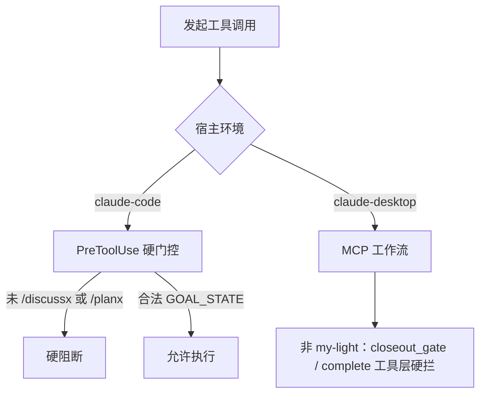
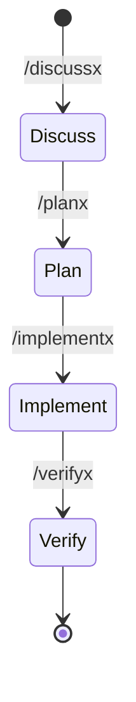

# Claude 宿主代理策略 (Claude Agent Policy)

跨宿主协议见 [`AGENTS.md`](AGENTS.md)。本文仅 Claude（`claude-code` / `claude-desktop`）宿主差异。

## 权威分层

| 类别 | 权威落点 |
|------|----------|
| 跨宿主叙述性协议 | 仓库根 [`AGENTS.md`](AGENTS.md) |
| Claude 专属执行面 | **`AGENTS_CLAUDE.md`**（本文件） |
| skill 路由 | `skills/SKILL_ROUTING_RUNTIME.json` |
| Claude Code hook 行为 | `.claude/settings.json` + `router-rs claude hook` |
| Claude Desktop MCP 行为 | `.claude/mcp.json` 或 `claude_desktop_config.json` + MCP tools |

**文档地图**：[`docs/harness_architecture.md`](docs/harness_architecture.md) · [`docs/hosts/claude.md`](docs/hosts/claude.md) · [`docs/hosts/claude-desktop.md`](docs/hosts/claude-desktop.md)

## Language

- 跨宿主语言规范见 [`AGENTS.md`](AGENTS.md) § Language；Claude 宿主强制继承，不得豁免。

## Worktree 隔离

- 跨宿主 worktree 隔离硬约束见 [`AGENTS.md`](AGENTS.md) § Git；本宿主强制继承，未经用户当轮显式批准不得在 worktree 中运行或修改。

## Claude 宿主特异性门控

### PreToolUse 硬阻断 (`claude-code`)

- `.claude/settings.json` + `pre-tool-use` hook 核查生命周期；未物化 `GOAL_STATE.json` 或未授权执行区 → **硬阻断**。
- 遭遇阻断时调用 `/discussx` 或 `/planx` 自愈，勿盲目重试。
- `ROUTER_RS_CLAUDE_*` 环境变量仅作用于 **Claude Code hook**。

### MCP 工作流 + tool-level closeout (`claude-desktop`)

- **无** PreToolUse / Stop shell hook；宿主原生 Bash/Write **不受 MCP 拦截**。
- 代理须主动调用 MCP：`framework_snapshot` → `skill_route` → `goal_state_manage` → `record_evidence` → `closeout_gate` → `complete`。
- **非 `my-light`**：`goal_state_manage complete` 与未满足之 `closeout_gate` 在 MCP 层 **硬拦**（`[Claude Desktop Hard Block]`）；`my-light` 仍为 advisory。
- 须对齐 `GOAL_STATE.json` 与 `artifacts/current/<task_id>/ROADMAP.md`、`WAVE_STATE.json`（见 [`skills/planx/SKILL.md`](skills/planx/SKILL.md)）。
- `ROUTER_RS_DESKTOP_*` 缓存 TTL 见 operator surface；**不**消费 `ROUTER_RS_CLAUDE_*`。
- **联网（Chat vs Cowork）**：Cowork 3P 下外网以 **`browser-mcp`** 为主；Chat 用 `web_fetch` → `browser-mcp`。运维 [`docs/hosts/claude-desktop-networking.md`](docs/hosts/claude-desktop-networking.md)；代理声明 project `.claude/CLAUDE.md`。

## 标准框架命令流

Claude **无** `AG_FOLLOWUP` / `REVIEW_GATE` 机读短码与 `updateCurrentStep`；流转靠显式框架命令：

- **`my-light`**：suppress hook 层 `REVIEW_GATE` 与 spawn-first（Code）；Desktop MCP closeout 亦为 advisory。
- **续跑**：无 hook 注入；重启后 `framework_goal_drive status` + `artifacts/current/<task_id>/` 手动画板。

## Knowledge Hygiene

- 本文件是 Claude 地图；跨宿主正文在 [`AGENTS.md`](AGENTS.md)。
