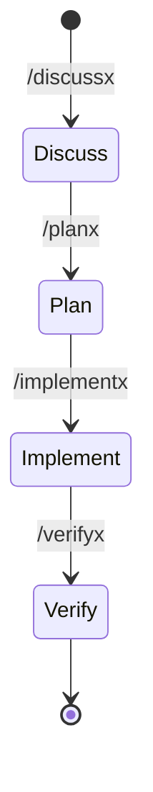

# Claude 宿主代理策略 (Claude Agent Policy)

跨宿主协议见 [`AGENTS.md`](AGENTS.md)。本文仅 Claude（`claude-code` / `claude-desktop`）宿主差异。

## 权威分层

| 类别 | 权威落点 |
|------|----------|
| 跨宿主叙述性协议 | 仓库根 [`AGENTS.md`](AGENTS.md) |
| Claude 专属执行面 | **`AGENTS_CLAUDE.md`**（本文件） |
| skill 路由 | `skills/SKILL_ROUTING_RUNTIME.json` |
| hook 行为 | `.claude/settings.json` + `router-rs` |

**文档地图**：[`docs/harness_architecture.md`](docs/harness_architecture.md) · [`docs/hosts/claude.md`](docs/hosts/claude.md) · [`docs/hosts/claude-desktop.md`](docs/hosts/claude-desktop.md)

## Claude 宿主特异性门控

### PreToolUse 硬阻断 (`claude-code`)

- `.claude/settings.json` + `pre-tool-use` hook 核查生命周期；未物化 `GOAL_STATE.json` 或未授权执行区 → **硬阻断**。
- 遭遇阻断时调用 `/discussx` 或 `/planx` 自愈，勿盲目重试。

### Advisory + MCP 后置拦截 (`claude-desktop`)

- 无 PreToolUse 物理拦截；MCP tool 服务端对未授权写操作 **Hard block**。
- 代理须主动对齐 `GOAL_STATE.json` 与 plan 工件 `artifacts/current/<task_id>/ROADMAP.md`、`WAVE_STATE.json`（见 [`skills/planx/SKILL.md`](skills/planx/SKILL.md)）。

## 标准框架命令流

Claude **无** `AG_FOLLOWUP` / `REVIEW_GATE` 机读短码与 `updateCurrentStep`；流转靠显式框架命令：

- **`my-light`**：suppress hook 层 `REVIEW_GATE` 与 spawn-first；findings-only 仍适用。
- **续跑**：无 hook 注入；重启后 `framework_goal_drive status` + `artifacts/current/<task_id>/` 手动画板。

## Knowledge Hygiene

- 本文件是 Claude 地图；跨宿主正文在 [`AGENTS.md`](AGENTS.md)。
