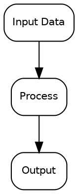
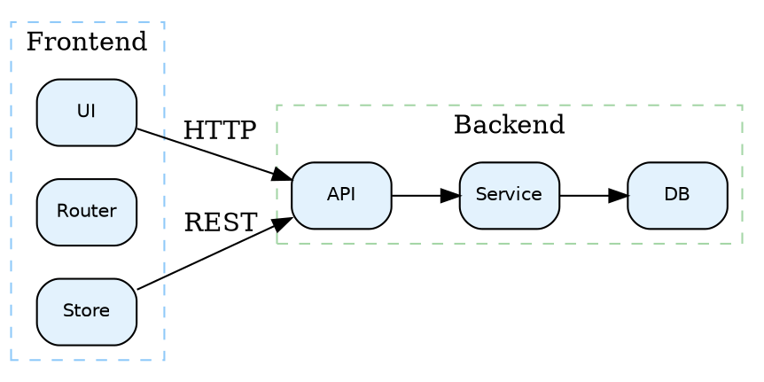
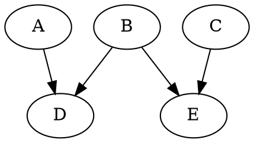
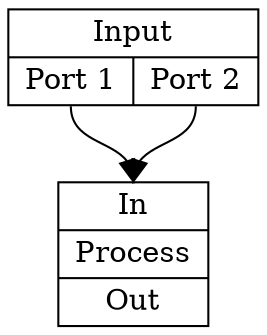
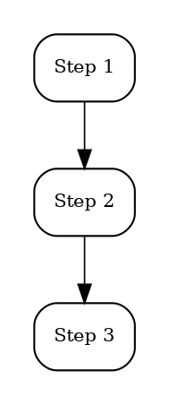
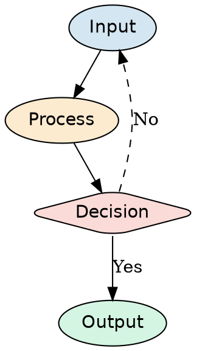

# graphviz-expert — Detailed Guide

> Extracted from SKILL.md to reduce token consumption at routing time.

## Task ownership and boundaries

This skill owns:
- DOT language syntax and best practices
- Layout engine selection (dot, neato, fdp, sfdp, circo, twopi, osage, patchwork)
- Node/edge/subgraph styling and positioning
- Export to PNG/SVG/PDF with publication-quality settings
- Complex graph layout strategies (clustering, ranking, port-based edges)

This skill does not own:
- Mermaid diagrams (→ `$mermaid-expert`)
- Data-driven charts (→ `$scientific-figure-plotting`)
- AI-generated images (→ `$image-generated`)

## Dependencies

```bash
# macOS
brew install graphviz

# Ubuntu/Debian
sudo apt-get install graphviz

# pip (Python bindings)
pip install graphviz
```

## Layout engine selection

| Engine | Best for |
|--------|----------|
| `dot` | Directed hierarchical graphs (default, most common) |
| `neato` | Undirected graphs, spring model layout |
| `fdp` | Large undirected graphs, force-directed |
| `sfdp` | Very large graphs (scalable force-directed) |
| `circo` | Circular layouts |
| `twopi` | Radial layouts |
| `osage` | Clustered layouts with packing |

## Core workflow

1. **Identify** — graph type, number of nodes/edges, layout requirements
2. **Choose engine** — `dot` for hierarchical, `neato`/`fdp` for force-directed
3. **Write DOT** — use subgraphs for clustering, ranks for alignment
4. **Style** — fonts, colors, shapes, edge styles
5. **Export** — render with appropriate DPI and format
6. **Review** — check for overlaps, readability, edge crossings

## DOT syntax quick reference

### Basic directed graph



### Subgraph clustering



### Rank alignment



### Port-based edges



## Publication-quality styling

### Black/white academic style



### Color-coded with subdued palette



## Export commands

```bash
# PNG (high DPI for papers)
dot -Tpng -Gdpi=300 diagram.dot -o diagram.png

# SVG (vector, editable)
dot -Tsvg diagram.dot -o diagram.svg

# PDF (for LaTeX inclusion)
dot -Tpdf diagram.dot -o diagram.pdf

# Using a different engine
neato -Tpng -Gdpi=300 network.dot -o network.png
fdp -Tsvg large_graph.dot -o large_graph.svg
```

### Bundled CLI

Use Graphviz commands directly for batch rendering with engine/format/DPI options:

```bash
dot -Tpng -Gdpi=300 input.dot -o input.png
dot -Tsvg input.dot -o input.svg
neato -Tpng -Gdpi=600 input.dot -o input.png
for f in *.dot; do dot -Tpdf "$f" -o "${f%.dot}.pdf"; done
```

## Python API

```python
import graphviz

dot = graphviz.Digraph('G', format='pdf')
dot.attr(dpi='300', fontname='Helvetica')
dot.attr('node', shape='box', style='rounded')

dot.node('A', 'Input')
dot.node('B', 'Process')
dot.node('C', 'Output')

dot.edge('A', 'B')
dot.edge('B', 'C')

dot.render('diagram', cleanup=True)
```

## Quality checklist

- Layout engine matches graph type
- No overlapping nodes or labels
- Edge crossings are minimized
- Font sizes are legible at target print size (≥8 pt)
- Colors (if used) are distinguishable and subdued
- Subgraph clusters have clear labels and boundaries
- Output format matches target (PDF for LaTeX, SVG for web, PNG for docs)
- DPI is sufficient for print (≥300)
