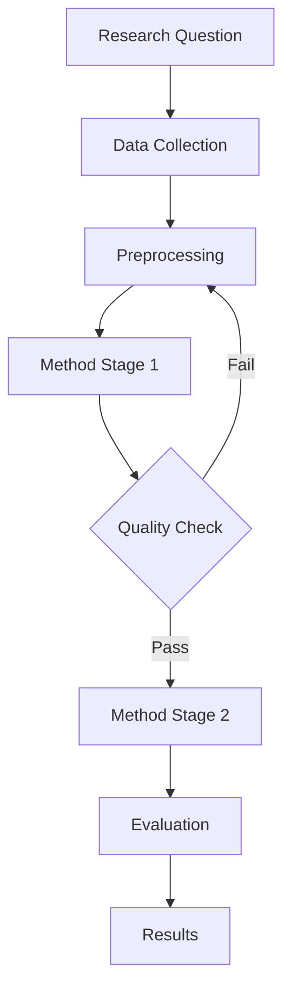
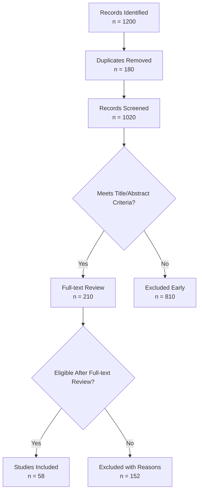
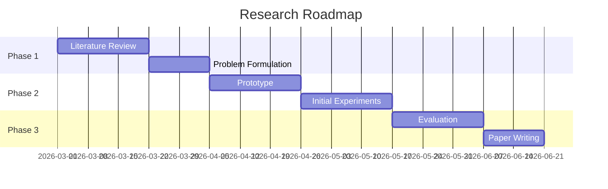
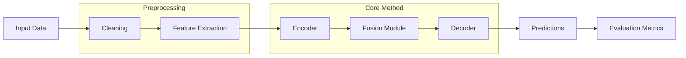
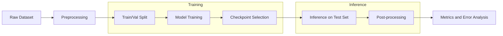
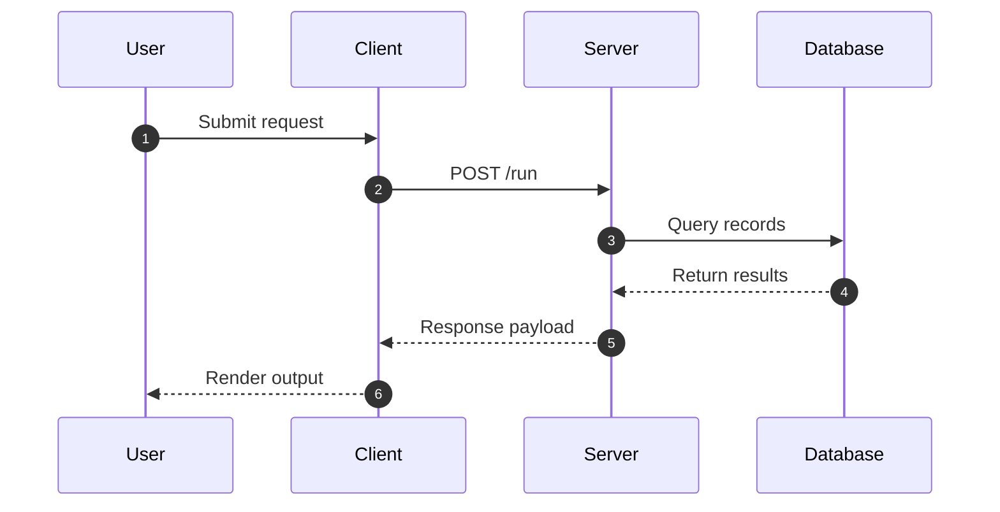
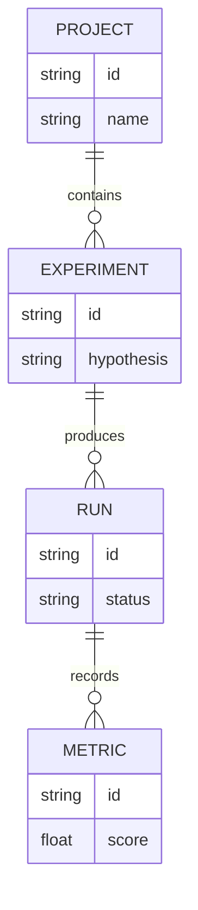
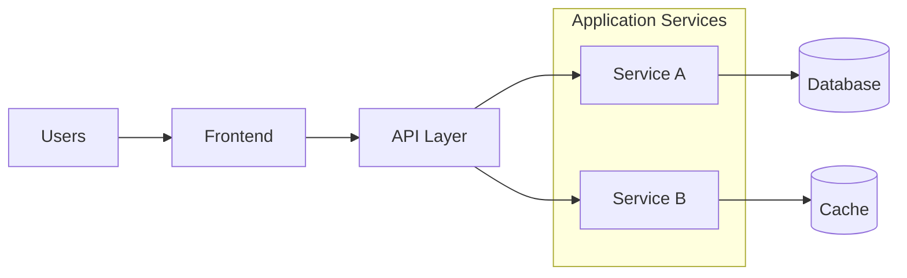

# Mermaid Expert Implementation Playbook

Use this playbook when the user needs concrete Mermaid patterns instead of only
high-level advice.

## 1. Research flowchart template



Best for:
- 研究流程图
- 实验流程
- 方法总览图

## 1b. Literature screening / PRISMA-like template



Best for:
- 文献筛选流程图
- PRISMA-like 草图
- 纳入/排除流程

## 2. Technical roadmap template



Best for:
- 技术路线图
- 研究计划
- 论文时间线

## 3. Method pipeline with grouped modules



Best for:
- 方法图
- 模型 pipeline
- 系统处理流程

## 3b. Training / inference split



Best for:
- 训练流程
- 推理流程
- 评测 pipeline

## 4. Sequence diagram template



Best for:
- API 时序图
- agent / service interaction
- 协议流程

## 5. ER diagram template



Best for:
- 数据模型
- 实验记录结构
- 实体关系梳理

## 6. Architecture diagram template



## 7. Practical rules

- If the user says “流程” but the real need is interaction timing, switch to `sequenceDiagram`
- If the user says “技术路线图” and includes dates/phases, prefer `gantt`
- If a flowchart grows beyond ~12 primary nodes, propose splitting it
- If labels become sentences, shorten labels and move detail into notes
- If the user wants “论文图” but also wants strict publication polish, warn that Mermaid is best for editable source diagrams, not always final camera-ready art
- If the user wants Word-style strict orthogonal flow layout, suggest Graphviz/DOT rather than stretching Mermaid past its strengths

## 8. Delivery pattern

Recommended response structure:

````markdown
## Mermaid Diagram
```mermaid
...
```

## Why this structure
- ...

## Assumptions
- ...
````

Optional add-on:

```markdown
## Caption
Figure X. Overview of the proposed workflow from data preparation to evaluation.
```
