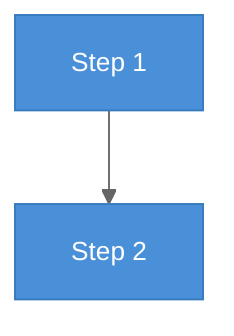
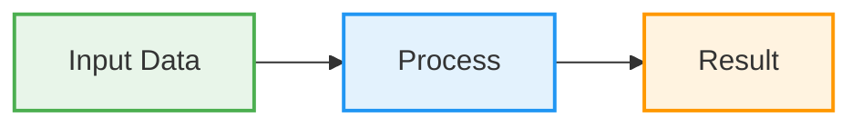
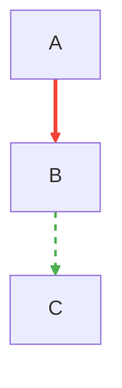
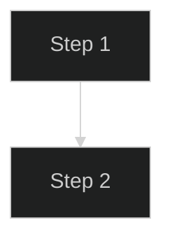

# Mermaid Styling, Export, and Dark Mode

## Advanced styling and theming

### Theme configuration

Use the `%%{init:}%%` directive at the top of any diagram to customize the theme:



Built-in themes: `default`, `dark`, `forest`, `neutral`, `base` (for full customization).

### classDef for node styling



### linkStyle for edge styling



### Academic-friendly restrained palette

For papers, use a disciplined low-saturation palette:

```
primaryColor: '#d4e6f1'      /* light blue */
secondaryColor: '#f2f3f4'    /* light grey */
tertiaryColor: '#fdebd0'     /* light amber */
lineColor: '#5d6d7e'         /* dark grey */
primaryTextColor: '#2c3e50'  /* near black */
```

---

## High-resolution export

### mermaid-cli (mmdc)

Install and use `mmdc` to export Mermaid diagrams as PNG, SVG, or PDF:

```bash
# Install mermaid-cli globally
npm install -g @mermaid-js/mermaid-cli

# Export to PNG (high DPI)
mmdc -i diagram.mmd -o diagram.png -s 4    # scale factor 4x

# Export to SVG (vector, editable)
mmdc -i diagram.mmd -o diagram.svg

# Export to PDF
mmdc -i diagram.mmd -o diagram.pdf

# With custom theme
mmdc -i diagram.mmd -o diagram.png -t dark

# With custom config
mmdc -i diagram.mmd -o diagram.png -c mermaid-config.json
```

Example `mermaid-config.json` for publication use:

```json
{
  "theme": "base",
  "themeVariables": {
    "fontSize": "16px",
    "fontFamily": "Inter, Helvetica, Arial, sans-serif"
  }
}
```

### Inline in Markdown

Most Markdown renderers (GitHub, GitLab, Notion, Obsidian) render Mermaid
natively in ` ```mermaid ` code blocks. No export needed for these platforms.

---

## Dark mode adaptation

For dark-mode friendly diagrams, use the `dark` theme or customize:



For dual-mode compatibility, prefer `neutral` theme (works reasonably on both
light and dark backgrounds) or provide two versions.

### Dual-mode strategy

1. **Single neutral theme** — use `neutral` (works on both light/dark, slightly muted)
2. **Two versions** — generate once with `default`, once with `dark`; embed conditionally
3. **CSS variable approach** — in custom web apps, use CSS variables for theme colors:

```mermaid
%%{init: {'theme': 'base', 'themeVariables': {
  'primaryColor': 'var(--diagram-primary)',
  'background': 'var(--diagram-bg)'
}}}%%
```

Note: CSS variables only work when Mermaid is rendered in a web context, not in
static mmdc exports.
