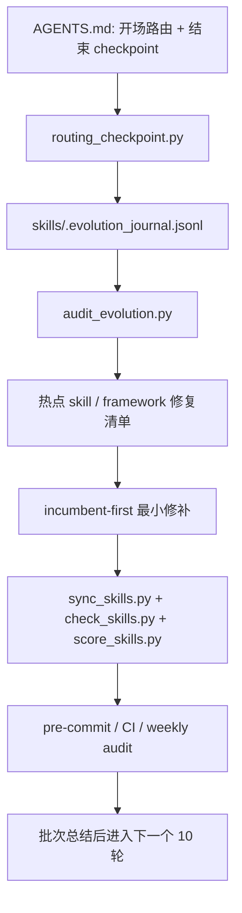

# Skill 自更新修复 + 全面 Git 化实施计划（Git-first / 100 轮分批自优化）

## 1. 总目标

把当前 skill 框架从“**部分 Git-native，但仍残留本地 / symlink 旧假设**”推进到真正稳定的 **Git-first** 形态，并修复自更新 / 自优化链路，使其同时满足：

- **长期稳定**：不再依赖 prompt-only 的侥幸执行
- **长期可维护**：规则、脚本、CI、hooks、文档一致
- **低 token 成本**：减少重复框架说明、冗余 frontmatter、重复触发词堆叠
- **触发稳定**：owner / gate / overlay 边界更清晰，减少误触发和 reroute
- **可持续自优化**：通过持久化数据 + 分批审计 + 小步修复形成闭环
- **skill 子进化可落实**：每个热点 skill 都能按 incumbent-first 原则做最小自修复，而不是只在框架层空谈

最终交付不是“再写一套理念文档”，而是：

1. 一个真正 **repo-first / Git-first** 的 skill 运行与维护框架
2. 一个真正能落地的 **自更新闭环**
3. 一套 **100 轮分 10 批**（每批 10 轮）的可执行自优化节奏
4. 一套更精简、更融合、更省 token 的路由框架

---

## 2. 用户约束（硬约束）

1. **本轮只优化 `implementation_plan.md`，不直接实现代码。**
2. 必须同时覆盖：
   - **修复 skill 自更新功能**
   - **完成全面 Git 化**
3. 总优化轮数为 **100 轮**，但必须按 **10 轮 / 批**执行：
   - 完成前 10 轮
   - 做批次总结与冻结
   - 再开始下一个 10 轮
   - **禁止一次性规划成“连续做完 100 轮不复盘”**
4. 计划里必须写清楚：
   - 每一步用什么具体 skill
   - skill 的子进化如何发生
   - token 节流如何被执行而不是口头强调

---

## 3. 现状校准（按真实仓库，不按过时假设）

当前仓库**并不是从零开始**。以下能力已经存在，应视为现有资产而不是待发明项：

### 已存在

- `scripts/routing_checkpoint.py`
- `scripts/audit_evolution.py`
- `skills/.evolution_journal.jsonl`
- `AGENTS.md` 中的 Git-native Self-Evolution Protocol
- `.github/workflows/skill-ci.yml`
- `.github/workflows/evolution-audit.yml`
- `.githooks/pre-commit`
- `.githooks/post-commit`

### 仍然残留的旧假设 / 断裂点

1. **校验脚本仍带 symlink / 本地镜像假设**
   - `scripts/check_skills.py` 仍有 `--verify-codex-link`
   - `scripts/sync_skills.py` 仍强依赖这条校验
2. **维护文档仍把 `~/.codex/skills` symlink 当成核心运行模式**
   - `skills/SKILL_MAINTENANCE_GUIDE.md`
   - 若干 framework skill 的 Validation 段落
3. **安装脚本仍是多工具 symlink 安装器思路**
   - `scripts/install_skills.sh`
4. **frontmatter 中大量残留 `source: local`**
   - 与全面 Git 化语义冲突
   - 还会增加全局 token 暴露成本
5. **自优化虽有骨架，但执行约束还不够硬**
   - checkpoint 已有，但缺少批次化推进、子进化策略和结果门禁
6. **规则文档存在重复与堆叠**
   - AGENTS / maintenance guide / framework skills / routing docs 有重复说明
   - 不利于触发稳定，也浪费 token

> 结论：这不是 greenfield 设计题，而是“**对已半迁移状态进行清理、收敛、硬化和分批自优化**”。

---

## 4. 三条总原则

### 4.1 Git-first 原则

- **仓库 `skills/` 是唯一事实来源**
- 本地仍需要 Git working tree，但**不应再依赖 Git 之外的第二份 live source**
- 所有维护、验证、审计、CI 都围绕仓库，而不是 `~/.codex/skills` 副本 / symlink 状态

### 4.2 Skill 子进化原则

所谓“skill 子进化”，不是新建一层抽象机制，而是：

- 当 journal / audit 指向某个热点 skill 时，
- **优先由该 skill 的 incumbent 自己完成最小修补**，
- 修补内容限于：
  - description 触发词
  - `## When to use`
  - `## Do not use`
  - session-start 提示
  - references 下沉
  - 必要 metadata 收口

即：

> **框架负责发现问题，incumbent skill 负责最小自修复。**

只有当问题涉及 owner / gate / overlay 重划分，才升级到框架级调整。

### 4.3 Token 节流原则

token 优化必须贯穿每一批，而不是最后统一“瘦身”。

每次改动默认遵守：

1. **先删重复，再补触发词**
2. **优先下沉到 `references/`，不把正文越写越长**
3. **优先改高曝光技能**：session-start、framework、热门 owner
4. **禁止通过堆砌规则文本来换稳定性**

---

## 5. 统一主链路（融合后）

### 主链路含义

- **框架层**发现问题：checkpoint / journal / audit
- **skill 层**执行子进化：incumbent-first 最小修补
- **验证层**负责兜底：sync / check / score / hooks / CI
- **批次层**负责节奏控制：10 轮一冻结

---

## 6. 执行中每一步用什么具体 skill

这部分是本计划的执行路由表。真正实施时，**每一步都必须先选 skill，再动手**。

| 步骤 | 目标 | 主 skill | 可选辅助 skill | 不该用的 skill |
|---|---|---|---|---|
| 1 | 判断这是框架级问题还是单 skill 问题 | `skill-developer-codex` | `idea-to-plan` | 不要直接上 `skill-writer` |
| 2 | 写 / 改本轮战略计划、批次计划、总结 | `idea-to-plan` | `skill-developer-codex` | 不要直接上 `skill-routing-repair-codex` |
| 3 | 判断是否需要并行分工 | `subagent-delegation` | 无 | 小任务不要启用 |
| 4 | 修 Git-first 主流程脚本与维护规范 | `skill-developer-codex` | `documentation-engineering` | 不要先做 token 微调 |
| 5 | 修某个具体 skill 的触发面 / description /边界文案 | `skill-routing-repair-codex` | `skill-writer` | 不要一上来新建 skill |
| 6 | 创建 / 拆分 / 重写具体 skill 包 | `skill-creator` | `skill-writer` | 不要用 `skill-developer-codex` 直接代替细节 authoring |
| 7 | 导入 / 重链路 / 接入新 skill | `skill-installer` | `skill-developer-codex` | 不要混同于 authoring |
| 8 | 批量标准化多个 skill 文本 | `writing-skills` | `skill-developer-codex` | 不要逐个手改当主策略 |
| 9 | 根因不明的脚本 / hook / CI 故障排查 | `systematic-debugging` | `skill-developer-codex` | 不要先改框架规则 |
| 10 | 压缩描述、下沉 references、做 token 收口 | `skill-writer` | `writing-skills` | 不要直接扩写 framework doc |
| 11 | 为脚本补测试 / 验证门禁 | `test-engineering` | `systematic-debugging` | 不要跳过验证 |
| 12 | 文档规范、README / guide 收口 | `documentation-engineering` | `skill-developer-codex` | 不要让 framework skill 独自承担所有文档整理 |

### 核心路由铁律

1. **框架问题** → `skill-developer-codex`
2. **单个 skill 的最小修补** → `skill-routing-repair-codex`
3. **单个 skill 的写法与压缩** → `skill-writer`
4. **批量多 skill 文案收口** → `writing-skills`
5. **具体 skill 包结构改写** → `skill-creator`
6. **接入 / 导入 / 安装类动作** → `skill-installer`
7. **未知故障先查因** → `systematic-debugging`

---

## 7. 四条主线（含 skill 分工）

## Workstream A — 全面 Git 化（repo-first）

### 目标

让所有维护、校验、说明、元数据都与 Git-first 现实一致，不再保留“本地额外 live source / symlink 镜像”思维。

### skill 分工

- **主 skill**：`skill-developer-codex`
- **文档收口辅助**：`documentation-engineering`
- **批量文本压缩辅助**：`writing-skills`
- **若脚本行为异常**：先切 `systematic-debugging`

### 关键动作

1. 从 `scripts/check_skills.py` 移除或降级 `--verify-codex-link`
2. 从 `scripts/sync_skills.py` 移除对此的强依赖
3. 重写 `skills/SKILL_MAINTENANCE_GUIDE.md` 为 repo-first 叙述
4. 重新定义 `scripts/install_skills.sh`：
   - 退役；或
   - 明确标注为兼容迁移工具，而非主路径
5. 批量清理 `source: local` 与过时 validation block

### 子进化落点

- 发现哪个 framework skill 还在传播 symlink 假设，就由该 skill 自己做最小修补
- 例如：
  - `skill-developer-codex`
  - `skill-routing-repair-codex`
  - `skill-writer`
  都要先修自己的 Validation / boundary 文案

### token 硬约束

- 清理 `source: local` 优先级高于补新说明
- 所有 Git-first 说明只保留一份 canonical 版本，其余文件引用而非重讲

---

## Workstream B — 自更新闭环硬化

### 目标

让 checkpoint → journal → audit → fix 变成真实执行链，而不是理论存在。

### skill 分工

- **主 skill**：`skill-developer-codex`
- **脚本故障排查**：`systematic-debugging`
- **验证与测试**：`test-engineering`
- **具体单 skill 修补**：`skill-routing-repair-codex`

### 关键动作

1. 强化 checkpoint 契约：什么时候必须记、最少记哪些字段
2. 强化 audit 输出：不仅给统计，还要给 incumbent-first 修补建议
3. 建立批次 ledger：记录每个 10 轮批次的目标、范围、结果、未决项
4. 让 hooks / CI 与自更新节奏对齐

### 子进化落点

每当 audit 指向某个热点 skill：

1. 先用 `skill-routing-repair-codex` 做该 skill 的最小修补
2. 若文案仍臃肿或触发词表达差，再用 `skill-writer` 压缩
3. 只有当边界已经不适合原 skill 承担时，才升级到 `skill-creator`

### token 硬约束

- journal 字段保持小而稳定，不新增大段 free-text
- audit 输出以“可执行修补建议”优先，避免长篇解释

---

## Workstream C — 触发稳定性与机制融合

### 目标

减少“多份规则叠加、边界重复、触发表达分散”的问题，让路由更稳、维护更简单。

### skill 分工

- **主 skill**：`skill-developer-codex`
- **单点修补**：`skill-routing-repair-codex`
- **单 skill 文案精修**：`skill-writer`
- **批量统一语言风格**：`writing-skills`

### 关键动作

1. 收口 canonical 规则源：
   - `AGENTS.md`
   - `skills/SKILL_ROUTING_INDEX.md`
   - `skills/SKILL_MAINTENANCE_GUIDE.md`
2. 减少 framework skills 间的重叠：
   - `skill-developer-codex`
   - `skill-routing-repair-codex`
   - `skill-writer`
   - `.system/skill-creator`
   - `.system/skill-installer`
3. 把机制堆叠改成单主链 + 明确分工
4. 基于 reroute 数据补强真实触发词，而不是泛化堆词

### 子进化落点

- 每个 reroute hotspot skill 都走一遍子进化 loop：
  1. `skill-routing-repair-codex` 定位最小修补点
  2. `skill-writer` 压缩并补真实触发词
  3. `sync/check/score` 验证
  4. checkpoint 记录是否收敛

### token 硬约束

- 先删重复段落，再补 trigger phrase
- examples 和 workflow 优先下沉 `references/`
- framework skill 正文优先保留边界，不保留长解释

---

## Workstream D — token 优化专项

### 目标

在不牺牲稳定性的前提下，实质性降低框架 token 暴露与重复扫描成本。

### skill 分工

- **主 skill**：`skill-writer`
- **批量处理辅助**：`writing-skills`
- **框架边界把关**：`skill-developer-codex`

### 关键动作

1. 批量移除无效 frontmatter，首选 `source: local`
2. 压缩高曝光 skill 的 description
3. 把长 checklist / 长案例 / 重复 validation 下沉到 `references/`
4. 清理重复 Validation block，特别是 `--verify-codex-link`

### 子进化落点

- 哪个 skill 被判定“高曝光且臃肿”，就由该 skill 自身优先进化
- 不做全库盲目压缩，优先：
  - framework skills
  - session-start skills
  - 高频 owner skills

### token 硬约束

每一轮都必须记录至少一个 token 相关成果，例如：

- 删除了多少重复字段
- 压缩了多少 description 字符数
- 下沉了哪些重复段落到 `references/`

---

## 8. 文件级改造清单（按 skill 路由）

## P0 — Git-first 成立所需

| 文件 | 主 skill | 可选辅助 |
|---|---|---|
| `AGENTS.md` | `skill-developer-codex` | `documentation-engineering` |
| `scripts/check_skills.py` | `skill-developer-codex` | `systematic-debugging` |
| `scripts/sync_skills.py` | `skill-developer-codex` | `systematic-debugging` |
| `skills/SKILL_MAINTENANCE_GUIDE.md` | `documentation-engineering` | `skill-developer-codex` |
| `implementation_plan.md` | `idea-to-plan` | `skill-developer-codex` |

## P1 — 自更新落地所需

| 文件 | 主 skill | 可选辅助 |
|---|---|---|
| `scripts/routing_checkpoint.py` | `skill-developer-codex` | `test-engineering` |
| `scripts/audit_evolution.py` | `skill-developer-codex` | `test-engineering` |
| `.githooks/pre-commit` | `skill-developer-codex` | `systematic-debugging` |
| `.github/workflows/skill-ci.yml` | `skill-developer-codex` | `github-actions-authoring` |
| `.github/workflows/evolution-audit.yml` | `skill-developer-codex` | `github-actions-authoring` |
| `skills/.evolution_journal.jsonl` 规范 | `skill-developer-codex` | 无 |

## P2 — 机制融合所需

| 文件 | 主 skill | 可选辅助 |
|---|---|---|
| `skills/skill-developer-codex/SKILL.md` | `skill-routing-repair-codex` | `skill-writer` |
| `skills/skill-routing-repair-codex/SKILL.md` | `skill-routing-repair-codex` | `skill-writer` |
| `skills/skill-writer/SKILL.md` | `skill-writer` | `skill-routing-repair-codex` |
| `skills/.system/skill-creator/SKILL.md` | `skill-routing-repair-codex` | `skill-writer` |
| `skills/.system/skill-installer/SKILL.md` | `skill-routing-repair-codex` | `skill-writer` |
| `skills/SKILL_ROUTING_INDEX.md` | `skill-developer-codex` | `documentation-engineering` |
| `skills/SKILL_ROUTING_LAYERS.md` | `skill-developer-codex` | `documentation-engineering` |

## P3 — 批量清理所需

| 范围 | 主 skill | 可选辅助 |
|---|---|---|
| 批量清理 `source: local` | `writing-skills` | `skill-developer-codex` |
| 批量修正 validation 命令 | `writing-skills` | `skill-developer-codex` |
| 批量压缩高曝光 description | `writing-skills` | `skill-writer` |

---

## 9. 100 轮自优化执行方案（10 批 × 每批 10 轮）

## 每轮统一模板（必须遵守）

1. **开场选 skill**
   - 框架问题：`skill-developer-codex`
   - 单 skill 修补：`skill-routing-repair-codex`
   - 单 skill 压缩：`skill-writer`
   - 批量统一：`writing-skills`
   - 故障未知：`systematic-debugging`
2. **读取最近证据**
   - journal
   - reroute / struggle 记录
   - CI / hook 输出
   - 上一批 batch summary
3. **只改 1–3 个目标点**
4. **执行 incumbent-first 子进化**
5. **运行验证**
6. **记录本轮结果、token 收益、是否值得继续同类修补**

> 一轮优化不追求“全面完美”，只追求“确定地让系统更稳、更轻、更可维护一点”。

## 三阶段总图

- **Phase I（Batch 1–3）**：迁移地基期
  - 目标：Git-first 成立、自更新闭环跑通、触发热点有第一轮收敛
- **Phase II（Batch 4–7）**：结构深修期
  - 目标：大规模 token 收口、热点 skill 子进化、覆盖更多 owner/gate skill
- **Phase III（Batch 8–10）**：长期稳态期
  - 目标：回归防护、审计质量提升、长期维护节奏固定

---

## Batch 1（Round 1–10）— Git-first 基线收口

### 目标

彻底去掉“主流程依赖本地 symlink / live copy”的旧前提。

### 本批主要 skill

- 主导：`skill-developer-codex`
- 文档收口：`documentation-engineering`
- 单点修补：`skill-routing-repair-codex`
- 批量清理：`writing-skills`

### Round 1–10 的具体动作

1. 盘点所有 symlink 假设 → `skill-developer-codex`
2. 修 `check_skills.py` / `sync_skills.py` 主流程 → `skill-developer-codex`
3. 若脚本行为与预期不符，先切 `systematic-debugging`
4. 重写 maintenance guide → `documentation-engineering`
5. 修 framework skills 中的旧 Validation block → `skill-routing-repair-codex`
6. 批量清理 `source: local` 与过时命令 → `writing-skills`

### 本批子进化要求

- 至少让 3 个 framework skill 完成一次“自修复”：
  - 旧假设删除
  - 边界更清晰
  - token 更短

### 本批 token 要求

- 不新增大段 Git-first 重复说明
- Git-first 定义必须只保留 1 个 canonical 来源

### 批次退出条件

- 主干脚本不再依赖 symlink 校验
- 核心文档不再把 symlink 视为事实前提
- 至少一批 `source: local` 被清掉

---

## Batch 2（Round 11–20）— 自更新闭环硬化

### 目标

让 checkpoint → journal → audit → fix 变成真实执行链。

### 本批主要 skill

- 主导：`skill-developer-codex`
- 故障排查：`systematic-debugging`
- 测试兜底：`test-engineering`
- 单点修补：`skill-routing-repair-codex`

### Round 11–20 的具体动作

1. 收紧 checkpoint 协议 → `skill-developer-codex`
2. 提升 audit 可操作性 → `skill-developer-codex`
3. 如脚本不稳，先查因 → `systematic-debugging`
4. 为关键脚本补验证 → `test-engineering`
5. 将 audit 热点映射到具体 skill 修补 → `skill-routing-repair-codex`

### 本批子进化要求

- 至少完成 1 条真实闭环：checkpoint → journal → audit → incumbent 修补 → 再验证

### 本批 token 要求

- journal 字段不膨胀
- audit 输出以短建议为主，不引入长篇 narrative

### 批次退出条件

- 能展示至少一条真实自更新闭环
- 批次 ledger 成型

---

## Batch 3（Round 21–30）— 触发稳定性修复

### 目标

基于真实 reroute 数据，修 framework skills 和高频 session-start skills 的触发面。

### 本批主要 skill

- 主导：`skill-developer-codex`
- 单 skill 修补：`skill-routing-repair-codex`
- 文案收口：`skill-writer`
- 批量风格统一：`writing-skills`

### Round 21–30 的具体动作

1. 找 reroute hotspot → `skill-developer-codex`
2. 对热点 skill 做最小修补 → `skill-routing-repair-codex`
3. 对臃肿 / 触发弱的正文做压缩 → `skill-writer`
4. 多个 skill 同类问题统一处理 → `writing-skills`

### 本批子进化要求

- 每个 hotspot skill 都要走一遍：诊断 → 最小修补 → 压缩 → 验证 → checkpoint

### 本批 token 要求

- 修触发词时禁止堆 synonym 列表
- 只补“真实发生过 reroute 的说法”

### 批次退出条件

- reroute 热点明显收敛
- framework 入口边界更清晰

---

## Batch 4（Round 31–40）— 深度融合 + token 收缩

### 目标

把机制堆叠收敛成少量 canonical 规则源，并显著降低 token 暴露成本。

### 本批主要 skill

- 主导：`skill-writer`
- 批量处理：`writing-skills`
- 框架边界把关：`skill-developer-codex`

### Round 31–40 的具体动作

1. 识别重复规则块 → `skill-developer-codex`
2. 单 skill 压缩与 references 下沉 → `skill-writer`
3. 批量统一 wording / validation / frontmatter → `writing-skills`
4. 如果压缩伤害边界表达，再回到 `skill-developer-codex` 复核

### 本批子进化要求

- 至少 10 个高曝光 skill 完成 token 收口型子进化

### 本批 token 要求

- 每轮必须记录一个明确“减 token”结果
- 不允许引入新的全库暴露字段来换短期方便

### 批次退出条件

- framework 文本更短但不更弱
- 高曝光 skill 的 description 更紧凑

---

## Batch 5（Round 41–50）— 长期维护稳定化（第一阶段封板）

### 目标

把前四批成果固化成第一阶段的长期可维护节奏、规则和门禁。

### 本批主要 skill

- 主导：`skill-developer-codex`
- 文档固化：`documentation-engineering`
- 最后单点修补：`skill-routing-repair-codex`
- 验证兜底：`test-engineering`

### Round 41–50 的具体动作

1. 验证 weekly audit / CI / hooks / local workflow 一致性 → `skill-developer-codex`
2. 收口长期维护说明 → `documentation-engineering`
3. 对残余边界问题做最小修补 → `skill-routing-repair-codex`
4. 为关键脚本 / 流程补最后一轮验证 → `test-engineering`

### 本批子进化要求

- 框架入口 skill 与维护入口 skill 均完成最终自修复
- 形成一版“50 轮中期稳定态”基线

### 本批 token 要求

- 只保留长期必要规则
- 删除为临时迁移而写的冗余说明

### 批次退出条件

- Git-first 稳定成立
- 自更新闭环稳定成立
- 前 50 轮有完整 ledger 和每批总结

---

## Batch 6（Round 51–60）— 全库热点 owner skill 扩面

### 目标

把子进化从 framework 核心层扩展到高频 owner skills，避免“只有框架层健康、实际 owner 层仍漂移”。

### 本批主要 skill

- 主导：`skill-routing-repair-codex`
- 单 skill 压缩：`skill-writer`
- 批量模式统一：`writing-skills`
- 总体优先级仲裁：`skill-developer-codex`

### Round 51–60 的具体动作

1. 从 journal 中提取高频 owner skill 热点 → `skill-developer-codex`
2. 对前 N 个 owner skill 做最小修补 → `skill-routing-repair-codex`
3. 对修补后仍臃肿的 skill 做 description / references 收口 → `skill-writer`
4. 若存在同类重复问题，批量统一 → `writing-skills`

### 本批子进化要求

- 至少 15 个非 framework 的 owner skill 完成一轮子进化

### 本批 token 要求

- owner skill 的压缩不能损伤领域边界
- 每个 skill 修补必须有“删掉了什么”记录，而不只是“加了什么”

### 批次退出条件

- 高频 owner skill 的 reroute 开始下降
- 非 framework 区域也出现稳定子进化样本

---

## Batch 7（Round 61–70）— gate / source / artifact 路由增强

### 目标

修复 gate 层识别不足，减少“本来该先走 gate，却直接落到 owner”的漂移。

### 本批主要 skill

- 主导：`skill-developer-codex`
- 单点修补：`skill-routing-repair-codex`
- 文档收口：`documentation-engineering`

### Round 61–70 的具体动作

1. 审计 gate miss / source miss / artifact miss → `skill-developer-codex`
2. 修 gate skill 的 session-start 与 trigger wording → `skill-routing-repair-codex`
3. 收口 routing index / layers 文档 → `documentation-engineering`
4. 若 gate 相关脚本或规则失配，再切 `systematic-debugging`

### 本批子进化要求

- 至少 5 个 gate / artifact 相关 skill 完成自修复

### 本批 token 要求

- gate 说明保持短、硬、先决条件明确
- 禁止把 gate skill 写成泛 owner skill

### 批次退出条件

- gate miss 明显下降
- 开场“先 gate 后 owner”执行更稳定

---

## Batch 8（Round 71–80）— 回归防护与验证增厚

### 目标

防止前 70 轮成果回退，把“易坏点”转成验证门禁或自动检查。

### 本批主要 skill

- 主导：`test-engineering`
- 根因排查：`systematic-debugging`
- 框架收口：`skill-developer-codex`

### Round 71–80 的具体动作

1. 找最容易回退的规则点 → `skill-developer-codex`
2. 给关键脚本 / hook / validator 增加验证覆盖 → `test-engineering`
3. 对 flaky 或不确定失败先查因 → `systematic-debugging`
4. 把验证门禁写回文档 → `documentation-engineering`

### 本批子进化要求

- 让“子进化结果”更多地由验证守住，而不是依赖人工记忆

### 本批 token 要求

- 优先用脚本 / 测试代替冗长人工说明
- 文档只写必要验证入口，不写大段操作性废话

### 批次退出条件

- 关键回归点被验证覆盖
- 日后维护不需要再靠重复口头提醒

---

## Batch 9（Round 81–90）— 审计质量升级与自更新提纯

### 目标

让 audit 不只“发现问题”，还更准确地给出哪类 skill 该如何进化，从而减少误修补和无效轮次。

### 本批主要 skill

- 主导：`skill-developer-codex`
- 故障排查：`systematic-debugging`
- 单点修补：`skill-routing-repair-codex`

### Round 81–90 的具体动作

1. 提升 audit 分类粒度：framework / gate / owner / token / docs → `skill-developer-codex`
2. 修正 audit 中误导性的建议模式 → `skill-developer-codex`
3. 若统计或判断异常，先查因 → `systematic-debugging`
4. 针对 audit 误导过的 skill 做补偿修补 → `skill-routing-repair-codex`

### 本批子进化要求

- 审计本身也要被视作可进化对象，不把它当完美组件

### 本批 token 要求

- audit 输出更结构化、更短、更能直接行动
- 减少解释性废话，增强 actionable items

### 批次退出条件

- 审计建议误报下降
- 后续轮次的修补命中率提升

---

## Batch 10（Round 91–100）— 最终收敛与长期稳态交接

### 目标

完成 100 轮后的最终收敛，把整个系统交接到长期维护模式，而不是继续无限膨胀地“优化下去”。

### 本批主要 skill

- 主导：`skill-developer-codex`
- 文档固化：`documentation-engineering`
- 终局压缩：`skill-writer`
- 最后回归兜底：`test-engineering`

### Round 91–100 的具体动作

1. 回顾前 9 批 ledger，删掉已无必要的临时策略 → `skill-developer-codex`
2. 固化长期维护手册与入口说明 → `documentation-engineering`
3. 对最终仍臃肿的框架技能做最后收缩 → `skill-writer`
4. 跑最终回归验证 → `test-engineering`
5. 生成最终迁移完成声明与长期维护 checklist → `checklist-writting` / `documentation-engineering`

### 本批子进化要求

- 子进化机制本身也完成收口：
  - 有发现链路
  - 有修补链路
  - 有验证链路
  - 有停止条件

### 本批 token 要求

- 最终框架不靠解释长度支撑，而靠结构清晰支撑
- 删除所有只在迁移期有意义、稳态期无意义的文本

### 批次退出条件

- Git-first 稳定成立
- 自更新闭环稳定成立
- 子进化机制稳定成立
- 100 轮优化有完整 ledger、阶段总结、最终移交说明

---

## 10. 每批 10 轮之间的强制停顿机制

每一批结束后必须执行：

1. **冻结当前批次结果**
   - 写 batch summary
   - 记录已解决 / 未解决项
2. **重新审视下一批目标**
   - 必须基于最新 audit 和 reroute 数据重排优先级
3. **重新做 skill 路由**
   - 下一批不自动沿用上一批的主 skill 组合
4. **判断是否值得继续下一个 10 轮**
   - 若当前阶段目标已收敛，可下调后续批次范围，但不能跳过复盘
5. **补写 token 收益总结**
   - 每批至少记录：删除了什么、收口了什么、哪些说明被下沉

> 即：计划承诺 100 轮，但执行上永远是“**10 轮一个闭环，批次复盘后再决定下一个 10 轮的精确动作**”。

---

## 11. 验收标准

## A. 全面 Git 化验收

- 主干维护流程不依赖 `~/.codex/skills` symlink
- 没有关键脚本把 symlink 当真源判断条件
- 仓库文档统一声明：**repo is source of truth**
- 全库不再残留大面积 `source: local`

## B. 自更新机制验收

- checkpoint 真正被使用
- journal 能稳定积累真实记录
- audit 能输出可执行修复建议
- 每批 10 轮都有明确记录和总结

## C. Skill 子进化验收

- hotspot skill 能按 incumbent-first 原则最小修补
- 单 skill 问题优先在 skill 内部收口，而不是反复升级为框架问题
- 只有 owner / gate / overlay 真变更时才触发 skill 拆分 / 重建
- 非 framework owner skills 与 gate skills 都有真实子进化样本

## D. token 优化验收

- framework 核心文档更短
- 高曝光 skill 的 description 更紧凑
- 冗余 frontmatter 显著减少
- 不再通过堆机制文本来换稳定性
- 每个批次都有明确 token 收益记录

## E. 长期维护验收

- 新 skill 接入、旧 skill 修补、framework 自优化三条路径边界明确
- CI / hooks / local workflow / docs 一致
- 不依赖单次会话记忆即可继续优化
- 100 轮后可以进入稳态维护，而不是继续无限扩张机制

---

## 12. 一句话执行摘要

先用 **Batch 1–3** 在 `skill-developer-codex` 主导下完成 Git-first 收口、自更新闭环打通和首轮触发稳定化，再用 **Batch 4–7** 结合 `skill-routing-repair-codex`、`skill-writer`、`writing-skills`、`documentation-engineering` 将子进化扩展到高曝光 owner / gate skill，并持续压缩 token，最后在 **Batch 8–10** 中通过 `test-engineering`、`systematic-debugging`、`skill-developer-codex` 把回归防护、审计质量和长期维护节奏彻底固化；全程始终遵守 **100 轮总量、每 10 轮一批、批次复盘后再进入下一批** 的节奏。

---

## 13. 批次执行模板（Batch Template）

> 每开始一个新的 10 轮批次，都先复制这一段生成当批执行页。禁止跳过。

### Batch Header

- **Batch 编号**：Batch X（Round A–B）
- **阶段**：Phase I / II / III
- **主目标**：
- **主导 skill**：
- **辅助 skill**：
- **主要风险**：
- **本批 token 目标**：
- **本批子进化覆盖范围**：

### Batch Entry Checklist

- [ ] 已读取最近 journal / audit / CI / hook 输出
- [ ] 已回顾上一批 summary
- [ ] 已确认本批只聚焦 1 个主目标 + 1 个次目标
- [ ] 已指定主导 skill 和辅助 skill
- [ ] 已写清楚本批不做什么

### Batch In-Scope

- 这批要修的东西：
- 这批暂时不碰的东西：
- 这批优先修的 skill 列表：
- 这批要观察的 reroute / struggle 指标：

### Batch Exit Criteria

- [ ] 主目标达成
- [ ] 至少形成 N 个有效子进化样本
- [ ] token 收益已记录
- [ ] batch summary 已写
- [ ] 决定是否进入下一批

---

## 14. 单轮执行模板（Round Template）

> 每一轮优化都必须填写最小记录，不允许“改完了但说不清本轮到底做了什么”。

### Round Header

- **Round 编号**：Round X
- **所属 Batch**：Batch Y
- **日期**：
- **对象**：framework / gate / owner / doc / script / validator
- **本轮主 skill**：
- **辅助 skill**：

### Round Input

- **证据来源**：
  - [ ] journal
  - [ ] audit
  - [ ] CI
  - [ ] hook
  - [ ] 人工观察
- **本轮问题一句话**：
- **为什么现在修它**：

### Round Action

- **只改 1–3 个点**：
  1.
  2.
  3.
- **采用的 skill 路由**：
- **是否发生子进化**：是 / 否
- **若是，哪个 incumbent skill 被修补**：

### Round Verification

- [ ] `sync_skills.py --apply`
- [ ] `check_skills.py` / 相关校验
- [ ] `score_skills.py` / 相关评分
- [ ] 必要测试 / hook / CI 验证
- [ ] 本轮无新增重复机制

### Round Output

- **本轮完成内容**：
- **本轮未解决内容**：
- **本轮是否需要 reroute**：是 / 否
- **下一轮是否继续同类问题**：是 / 否

### Round Token Ledger

- **删除的内容**：
- **压缩的内容**：
- **下沉到 references 的内容**：
- **估计 token 收益**：

---

## 15. Hotspot Skill 子进化模板（Incumbent Evolution Template）

> 当某个 skill 被 journal / audit 标记为热点时，必须优先按这个模板做最小修补，而不是直接升格成框架重构。

### Hotspot Skill Card

- **Skill 名称**：
- **类型**：framework / gate / owner / overlay
- **热点信号**：reroute / struggle / trigger miss / token bloat / overlap
- **来源证据**：
- **是否属于 incumbent-first 可修复问题**：是 / 否

### 最小修补路径

1. **先判断是否只需 `skill-routing-repair-codex`**
   - 适用：触发词、边界词、`When to use` / `Do not use`、session-start 提示
2. **若正文臃肿，再调用 `skill-writer`**
   - 适用：description 压缩、references 下沉、示例收口
3. **若多个 skill 同类问题，再调用 `writing-skills`**
   - 适用：批量统一 wording / validation / frontmatter
4. **只有 owner / gate / overlay 角色真的变了，才调用 `skill-developer-codex` 或 `skill-creator`**

### 修补清单

- [ ] description 是否更短且更准
- [ ] `When to use` 是否补到真实说法
- [ ] `Do not use` 是否更清晰
- [ ] session-start 词是否只保留必要部分
- [ ] 是否删除了重复 Validation block
- [ ] 是否有内容可下沉到 `references/`

### 退出条件

- [ ] reroute / struggle 信号下降
- [ ] skill 没有因为压缩而失去边界
- [ ] 没有为修这个 skill 引入新机制

---

## 16. Token 台账模板（Token Budget Ledger）

> token 节流不能只写“这轮更短了”，必须有结构化记录。

### Per-Round Token Ledger

- **Round**：
- **目标对象**：
- **删掉的字段**：
- **删掉的重复段落**：
- **下沉到 `references/` 的内容**：
- **压缩的 description**：
  - before:
  - after:
- **是否新增全局暴露文本**：是 / 否
- **净效果判断**：更轻 / 持平 / 更重

### Per-Batch Token Summary

- **Batch**：
- **本批删除的 frontmatter 项数**：
- **本批压缩的 skill 数量**：
- **本批下沉到 references 的段落数**：
- **本批新增的高曝光文本数**：
- **本批总体判断**：
  - [ ] 更短
  - [ ] 更稳
  - [ ] 更易维护
  - [ ] 没有靠堆文本换稳定性

---

## 17. 100 轮执行时的禁止事项

1. **禁止把 100 轮理解成 100 次无差别修文案**
   - 必须围绕证据、热点、门禁、验证推进
2. **禁止为了“看起来在进化”而不断新建 skill / 新建脚本 / 新建规则文件**
   - 先问：现有 incumbent 能不能修
3. **禁止只记录“加了什么”，不记录“删了什么”**
   - token 节流必须可见
4. **禁止跳过 batch summary**
   - 没有 summary，就不允许进入下一批
5. **禁止把所有问题都上升为 framework 问题**
   - 单 skill 问题优先单 skill 收口
6. **禁止把所有 token 问题都交给最后一批处理**
   - 每一批都要有 token 收益
7. **禁止因为轮次变多，就放弃每 10 轮复盘的纪律**
   - 轮次越多，越要靠模板和台账保持收敛

---

## 18. 最终建议：执行顺序的最小闭环

如果真正开始执行 100 轮，不要从“写第 1 轮 patch”开始，而是按下面顺序启动：

1. 复制 **Batch 1 模板**
2. 填写 **Round 1 模板**
3. 选对主 skill（大概率是 `skill-developer-codex`）
4. 做 1 个最小修补
5. 写 **Round Token Ledger**
6. 连续做到 Round 10
7. 写 **Batch 1 Summary**
8. 再决定是否进入 Batch 2

> 也就是说，计划本身现在已经不只是“路线图”，而是“可直接反复执行的操作框架”。
