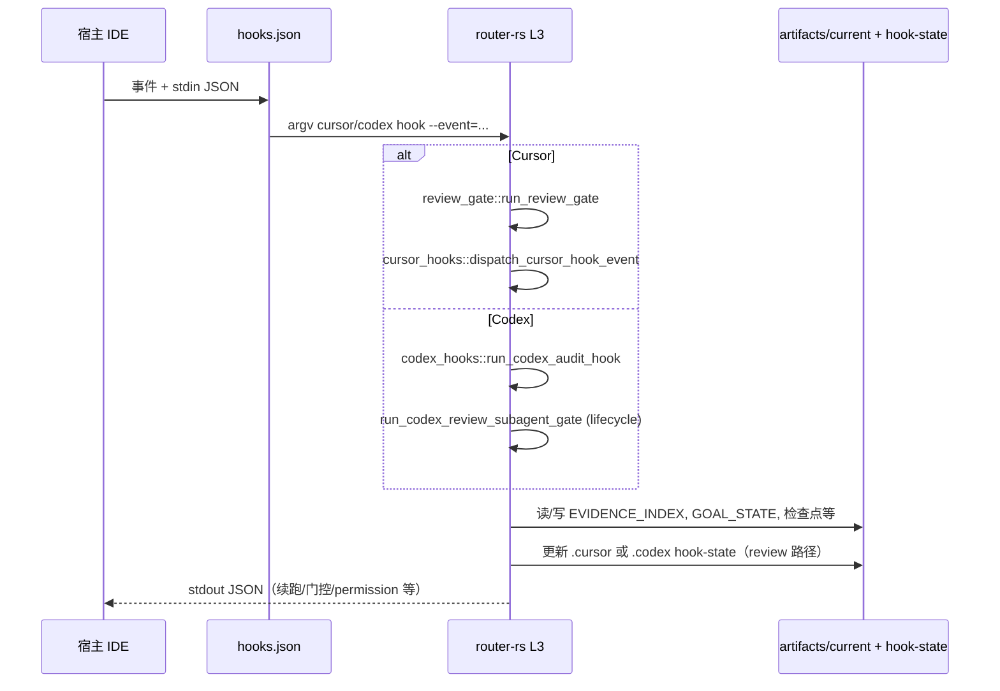

# Codex / Cursor 运行时架构调研笔记

**产出路径（真源）**：`docs/plans/RESEARCH_codex_cursor_runtime_architecture.md`  
**对应计划（只读引用）**：`~/.cursor/plans/codex_cursor_runtime_deep_dive_1ed2fee1.plan.md`  
**仓库根**：`/Users/joe/Documents/skill`

---

## Executive summary

本仓库把「可执行验证 → 落盘连续性 → Rust 控制面 → 宿主 hook 投影 → skill/注册表契约」压成一条依赖链：**L1 只产出 exit code；L2 在 `artifacts/current/` 等路径保留可审计事实；L3 `router-rs` 负责门控、证据行追加、续跑块合并；L4 各宿主 `hooks.json` 只做 argv/stdin/超时转发；L5 的 `SKILL_ROUTING_RUNTIME.json` 与 `RUNTIME_REGISTRY.json` 定义路由与显式 framework 命令，但不在 skill 内实现 REVIEW 状态机**（见 `docs/harness_architecture.md` §1–§2.1）。

**Codex** 与 **Cursor** 的差异主要在事件名与 JSON 形状：Codex 生命周期事件经 `router-rs codex hook` 进入 `codex_hooks` 的 review/gate 与 digest 分支；Cursor 经 `router-rs cursor hook` → `review_gate::run_review_gate` → `cursor_hooks::dispatch_cursor_hook_event`，出站字段为宿主消费的 `additional_context` / `followup_message`（见 `docs/host_adapter_contract.md` §2；`scripts/router-rs/src/cli/dispatch_body.txt`）。

**只读验证**：已在仓库根执行 `cargo run --manifest-path scripts/router-rs/Cargo.toml -- framework task-state-resolve --repo-root /Users/joe/Documents/skill`，得到与 `docs/task_state_unified_resolve.md` §4 一致的 JSON 视图（`schema_version`=`router-rs-resolved-task-view-v1` 等）。`cargo test … -- --list` 在本机输出与编译进度行交织，测试名索引以下文**源码锚定**的用例为准；若需可脚本化列表，建议在 CI 或本地用稳定 grep 目标二进制测试列表。

---

## 分层架构（L1–L5）

| 层 | 职责（应当） | 反模式（不应当） | 依据 |
|----|----------------|------------------|------|
| **L1** | 测试/命令产生 exit code 与报告 | hook「替跑」验证 | `docs/harness_architecture.md` §1 图、§2 表 |
| **L2** | `artifacts/current/<task_id>/` 下 SESSION_SUMMARY、NEXT_ACTIONS、EVIDENCE_INDEX、GOAL_STATE、RFV_LOOP_STATE 等单一真源 | 把聊天当状态机 | 同文 §1–§2；`AGENTS.md` Continuity artifacts |
| **L3** | `router-rs`：合并续跑、PostTool 证据采样、REVIEW_GATE 状态、closeout 校验等 | 承载领域长文案；无登记地加 env | `docs/harness_architecture.md` §2 表、§5；`scripts/router-rs/src/router_env_flags.rs` 文件头 |
| **L4** | `.cursor/hooks.json` / `.codex/hooks.json`：短命命令 + stdin 透传 + 超时 | 在 shell 复制 L3 分支 | `docs/harness_architecture.md` §6 表；`docs/host_adapter_contract.md` §4 |
| **L5** | `skills/**/SKILL.md`、路由 runtime、RFV 契约文档 | 第二套 EVIDENCE 格式；skill 内复制门控 | `docs/harness_architecture.md` §2.1（Review 三层分离）、§6 |

**依赖向**：只允许 L1→L2→L3→L4 向上消费；**L5 不得绕过 L2 自称完成**（软门禁场景除外），见 `docs/harness_architecture.md` §1。

**Review 三层分离**（勿混）：(a) `skills/SKILL_ROUTING_RUNTIME.json` 只管路由；(b) `.cursor/rules/*.mdc` 与 `AGENTS.md` 为执行叙事；(c) `router-rs` + `.cursor/hook-state` 为 Cursor REVIEW_GATE 状态机，见 `docs/harness_architecture.md` §2.1。

---

## Codex 路径 vs Cursor 路径

### 对照表

| 维度 | Codex | Cursor | 依据 |
|------|--------|--------|------|
| L4 配置 | 项目 `.codex/hooks.json`（`codex sync` / install 生成）；用户侧 `install-codex-user-hooks` 写 `hooks.json` | 仓库 `.cursor/hooks.json` | `docs/host_adapter_contract.md` §2、§3 路径表；本仓库 `.cursor/hooks.json` |
| CLI 入口 | `router-rs codex hook …`（`dispatch_codex_command` → `run_codex_audit_hook`） | `router-rs cursor hook …`（`dispatch_cursor_command` → `run_review_gate`） | `scripts/router-rs/src/cli/dispatch_body.txt` L137–L184 |
| stdin 归一化后核心 | 生命周期事件进入 `run_codex_review_subagent_gate` → `handle_codex_session_start` / `handle_codex_posttooluse` / `handle_codex_stop` 等 | `dispatch_cursor_hook_event` 按事件名分发 `handle_session_start`、`handle_before_submit`、`handle_stop`、`handle_post_tool_use` 等 | `scripts/router-rs/src/codex_hooks.rs`（grep `SessionStart`/`run_codex_review_subagent_gate`）；`scripts/router-rs/src/cursor_hooks.rs` `dispatch_cursor_hook_event` |
| Review 门磁盘状态 | `.codex/hook-state`（文内指针；与 Cursor 对称叙事） | `.cursor/hook-state` | `docs/harness_architecture.md` §2.1；`docs/host_adapter_contract.md` §2 Cursor 行 |
| 出站提示字段 | Codex 响应 JSON / `additionalContext` 等（以各 handler 为准） | `additional_context` / `followup_message`（`ROUTER_RS_CURSOR_HOOK_CHAT_FOLLOWUP` 切换） | `docs/harness_architecture.md` §3.2；`scripts/router-rs/src/router_env_flags.rs` `router_rs_cursor_hook_chat_followup_enabled` |
| AGENTS.md | 磁盘为编辑真源；Codex 可用**编译期嵌入**快照，需 `cargo build` + `codex sync` 刷新 | Cursor 框架规则由 `framework install --to cursor` 渲染 `.cursor/rules/framework.mdc`，**不经** `codex sync` | `AGENTS.md` 权威分层表；`AGENTS.md`「Codex：`AGENTS.md` 构建快照」 |

### 闭集宿主 id（`RUNTIME_REGISTRY.json` 真源）

当前 `host_targets.supported`：**`codex-cli`**, **`codex-app`**, **`cursor`**, **`claude-code`**（与 `configs/framework/RUNTIME_REGISTRY.json` L12–17 一致）。

> **历史提示（已修复）**：曾存在 `docs/rust_contracts.md` §Host Projection Invariants 与 `host_targets.supported` 不一致的叙述；**2026-05-11** 起以该英文契约文件更新为准。权威列表仍以 **`RUNTIME_REGISTRY.json` + `framework_host_targets.rs`** 与 `docs/host_adapter_contract.md` 文首为准。

### 主序列（Mermaid）

依据：`docs/host_adapter_contract.md` §1–§2；`scripts/router-rs/src/review_gate.rs`；`scripts/router-rs/src/cursor_hooks.rs` `dispatch_cursor_hook_event`；`scripts/router-rs/src/codex_hooks.rs` `run_codex_audit_hook` / `run_codex_review_subagent_gate`。

### 符号对齐（rg 验证）

- **`dispatch_cursor_hook_event`**：`pub(crate) fn dispatch_cursor_hook_event(repo_root, event_name, payload) -> Value`，定义于 `scripts/router-rs/src/cursor_hooks.rs`（本调研读取约 L3792 起）。
- **`run_review_gate`**：读 stdin → `resolve_cursor_hook_repo_root` → **`dispatch_cursor_hook_event`** → `scrub_followup_fields_in_hook_output` → `apply_cursor_hook_output_policy`，见 `scripts/router-rs/src/review_gate.rs`。
- **Codex `codex hook`**：`dispatch_codex_command` 的 `CodexCommand::Hook` 分支调用 **`run_codex_audit_hook`**（非直接调用 `dispatch_cursor_hook_event`），见 `scripts/router-rs/src/cli/dispatch_body.txt` L148–157；生命周期语义在 `codex_hooks.rs` 内 `run_codex_review_subagent_gate` 匹配 `sessionstart`/`posttooluse`/`stop` 等。

---

## State & artifacts（ResolvedTaskView、指针、冲突）

| 概念 | 说明 | 依据 |
|------|------|------|
| **`resolve_task_view`** | 多账本只读聚合默认入口；CLI `framework task-state-resolve` | `docs/task_state_unified_resolve.md` §2–§4；`dispatch_body.txt` `FrameworkCommand::TaskStateResolve` |
| **`task_id` 解析 v1** | `override > active_task.json > focus_task.json`；**不含** mtime 扫盘（扫盘为 Stop hydrate 补救路径） | `docs/task_state_unified_resolve.md` §2 |
| **`TaskControlMode`** | `idle` / `autopilot` / `rfv_loop` / **`conflict`**（GOAL 续跑与 RFV `loop_status=active` 同时成立） | 同文 §2.3、§3 |
| **`CursorContinuityFrame`** | `pointer_view` + `hydration_goal`（含 `read_goal_state_for_hydration`），供 beforeSubmit/Stop 合并与 AG_FOLLOWUP hydrate | `scripts/router-rs/src/task_state.rs` L20–39 |
| **`DepthCompliance`** | RFV 轮次、EVIDENCE、goal checkpoint rollup；与可选硬门禁 `completion_gates` / `close_gates` 分工见 harness §4/§8 | `scripts/router-rs/src/task_state.rs` L55–68；`docs/harness_architecture.md` §4、§8、`docs/references/rfv-loop/reasoning-depth-contract.md` 指针 |

**实证**：`framework task-state-resolve` 对本仓库输出含 `pointers`、`goal_state`、`evidence`、`depth_compliance`、`control_mode` 字段（与 `docs/task_state_unified_resolve.md` §3 概念表一致）。

---

## Configuration surface

| 面 | 内容 | 依据 |
|----|------|------|
| **`RUNTIME_REGISTRY.json`** | `host_targets.supported` + `metadata.<id>.install_tool` + `host_entrypoints`；`framework_commands` 与 autopilot/gitx/team 等契约 | `configs/framework/RUNTIME_REGISTRY.json`；`docs/host_adapter_contract.md` §0、§3.1 |
| **`framework_host_targets.rs`** | 从注册表 fail-closed 加载；`skills_install_tool_for_host_id` 等 | `scripts/router-rs/src/framework_host_targets.rs` L1–65 |
| **`ROUTER_RS_*`** | 默认 true/false 语义、聚合关断 `ROUTER_RS_OPERATOR_INJECT`、beforeSubmit opt-in 等 | `scripts/router-rs/src/router_env_flags.rs`；`docs/harness_architecture.md` §8 矩阵；`AGENTS.md` 个人使用 |
| **Operator 文案** | `configs/framework/HARNESS_OPERATOR_NUDGES.json`（`schema_version`: `harness-operator-nudges-v1`）；关断 `ROUTER_RS_HARNESS_OPERATOR_NUDGES` / 总闸 `ROUTER_RS_OPERATOR_INJECT` | `configs/framework/HARNESS_OPERATOR_NUDGES.json`；`docs/harness_architecture.md` §5 规则 4–5、§8 |
| **Skill 路由** | `skills/SKILL_ROUTING_RUNTIME.json`：`records[]` 含 `slug`、`skill_path`、`kind`（`skill` \| `framework_command`）、`plugin.runtime_refs` 等；`scope.fallback_manifest` | 本文件抽样；`AGENTS.md` Skill Routing |

**`framework_command` ↔ 注册表抽样（≥3）**

| runtime `slug`（示意） | `skill_path` | `RUNTIME_REGISTRY` | 依据 |
|-------------------------|----------------|-------------------|------|
| `autopilot` | `skills/autopilot/SKILL.md` | `framework_commands.autopilot` | `skills/SKILL_ROUTING_RUNTIME.json` records；`RUNTIME_REGISTRY.json` |
| `gitx` | `skills/gitx/SKILL.md` | `framework_commands.gitx`（注册表内同结构） | 同上 |
| `team` | `skills/agent-swarm-orchestration/SKILL.md` | `framework_commands.team` | 同上（runtime 中 `slug` 为 `team`，路径指向 swarm orchestration skill） |

---

## Test / spec 索引（测试名 → 行为一句话）

### `tests/host_integration.rs`（≥2）

| 测试名 | 行为一句话 |
|--------|------------|
| `shell_installer_e2e_writes_expected_files` | 校验 `maint install-codex-user-hooks` 写入的 `hooks.json` 含 `SessionStart`/`PostToolUse`/`Stop` 等且命令指向 `codex hook --event=`。 | `tests/host_integration.rs` L12–40 |
| `install_native_integration_is_idempotent` | 两次 `install-native-integration` 成功且 symlink 技能面、framework alias、`config.toml` 特征块不重复损坏。 | 同文件 L44–138 |
| `install_skills_cursor_target_installs_only_cursor` | `--to cursor` 安装路径仅触及 Cursor 投影语义（与 codex 分离）。 | 同文件 L396 起（grep 定位） |
| `runtime_registry_prefers_repo_local_registry_for_explicit_repo_root` | 显式 `--repo-root` 时加载仓库内注册表而非误用他处。 | 同文件 L1520 起 |

### `scripts/router-rs/src/main_tests.rs`（≥2）

| 测试名 | 行为一句话 |
|--------|------------|
| `continuity_digest_aligns_with_task_state_depth_rollup_on_repo_root` | SessionStart digest 与 `task_state` 深度 rollup 对齐。 | `main_tests.rs` L692 起 |
| `cursor_post_tool_evidence_appends_cargo_test_after_continuity_seed` | Cursor PostTool 路径在连续性种子后追加类 `cargo test` 证据行。 | 同文件 L974 起 |
| `framework_session_artifact_write_blocks_completion_without_closeout_record` | 完成态写 session artifact 时无合规 `closeout_record` 则阻断。 | 同文件 L1295 起 |
| `routing_eval_report_matches_expected_baseline` | 加载 `tests/routing_eval_cases.json` 并对全量 case 跑路由断言与基线一致。 | 同文件 L2655 起 |

### `tests/routing_eval_cases.json`（≥2）

| case `id` | 行为一句话 |
|-----------|------------|
| `plan-mode-cursor-plan-verifiable-todos-case` | 含 Cursor Plan / 可验收 todo 语料须命中 `plan-mode` owner。 | `tests/routing_eval_cases.json` L60–66 |
| `native-runtime-planning-does-not-force-skill` | 「按 PRD 直接实现」类任务不应错误强制某 skill（`expected_owner`: `none`）。 | 同文件 L69–76 |
| `openai-docs-source-gate-case` | OpenAI 官方文档类请求命中 `openai-docs`（L1 source gate）。 | 同文件 L50–57 |
| `generic-multi-agent-delegation-gate-case` | 多 agent 委派语料触发 delegation gate 与预期 owner 行为（与 `category` 一致）。 | 同文件 L79 起 |

---

## Open questions / risks

1. ~~**`docs/rust_contracts.md` 与 `RUNTIME_REGISTRY.json` 宿主列表不一致**~~ **已处理**：`docs/rust_contracts.md` §当前真源 / §Host Projection Invariants 已与 `host_targets.supported` 对齐，并显式区分 **`build_profile_bundle` 仅向 `host_payloads` 写入 `codex-cli`** 与安装闭集宿主列表（见 `scripts/router-rs/src/framework_profile.rs` `build_profile_bundle`）。  
2. **Codex hook CLI 命名心智模型**：`dispatch_body` 将 `codex hook` 统一导入 `run_codex_audit_hook`，生命周期与 `pre-tool-use`/`contract-guard` 共用入口，阅读代码需结合 `canonical_codex_audit_command` 分支（`scripts/router-rs/src/codex_hooks.rs`）。  
3. **`cargo test -- --list` 可观测性**：本机运行列表与 `cargo` 进度输出交织，不利于自动化 grep；CI 或文档可推荐固定 `--message-format` 或测试 crate 拆分。  
4. **第三宿主能力降级**：`session_supervisor`、`framework_profile` 等仍以 Codex 为硬编码主轴，扩展宿主时需对照 `docs/host_adapter_contract.md` §3.2 盘点表做文档或代码扩展。  

---

## 附录：L3 共享模块速查（与计划文件一致）

| 模块 | 角色 | 依据 |
|------|------|------|
| `hook_common.rs` | Cursor/Codex 共享启发式（review/delegation 等），不承载宿主 JSON 分发 | 文件头 L1–2；`docs/host_adapter_contract.md` §1 |
| `closeout_enforcement.rs` | `closeout_record` schema 校验与 session 负载门禁 | 文件头 schema 常量；`docs/harness_architecture.md` §7 |
| `rfv_loop.rs` / `autopilot_goal.rs` | RFV 状态与 GOAL 续跑、与 hook 输出合并 | `AGENTS.md` Autopilot / Continuity；`dispatch_cursor_hook_event` 内 merge 调用链 |
| `host_integration.rs` | `framework install --to <host>` 投影与 native 安装 JSON | `docs/host_adapter_contract.md` §3；`AGENTS.md` 权威分层表 |

---

## 执行后续：`framework_profile_contract.md` 核对（2026-05-11）

- **`docs/framework_profile_contract.md` Hard Rules 第 1 条**（「framework core 只允许 closed-set host projection：`codex-cli` 与 `cursor`」）与代码对照：`build_profile_bundle` **仅**向 `host_payloads` 插入 **`codex-cli`**（`scripts/router-rs/src/framework_profile.rs` L161–164）；未见同函数内写入 `cursor` 键。该 Hard Rule 将 **profile bundle 的宿主面** 写成 `codex-cli` 与 `cursor` 二元，与当前 `host_payloads` 实现（仅 `codex-cli`）**部分一致、部分偏宽**；**未**在本次执行中修改该中文契约文件，以免无设计评审扩 scope。运行时 **闭集宿主 id** 仍以 `RUNTIME_REGISTRY.json` → `host_targets.supported` 与 `docs/rust_contracts.md` 英文段为准。

### `docs/` 可选全文检索（过时「仅两宿主=supported」类句）

- **`docs/host_adapter_contract.md`**（checklist 中「与现网 `codex-cli` / `cursor` **对称**」）：指元数据形状示例，**非**断言 `host_targets.supported` 只有两宿主 → **不改**。
- **`docs/plans/harness_host_round2.md`**（`codex-cli` / `cursor` 投影 manifest 矩阵）：历史计划语境 → **不改**。
- **`docs/framework_profile_contract.md`**：见上节 triage → **不改**。

---

## 计划收口对照（调研 deep dive + `runtime_doc_drift_execution`）

| 项 | 状态 |
|----|------|
| 调研计划 Phase A–F（`codex_cursor_runtime_deep_dive_1ed2fee1.plan.md`） | 已完成；交付物为本笔记早期章节 |
| `align-rust-contracts-hosts` | 已完成：`docs/rust_contracts.md` 已对齐 `host_targets.supported` 并区分 profile bundle |
| `profile-contract-triage` | 已完成：结论见上「执行后续」节 |
| `optional-doc-scan` | 已完成：见上表，无额外补丁 |
| **Verify** | 请在宿主主会话执行 **`/gitx plan`**（与 `/gitx` 同契约，`skills/gitx/SKILL.md`），对照上述调研计划与本执行计划逐项勾选；提交前 `git status`：**本执行引入/更新的路径**主要为 `docs/rust_contracts.md` 与 `docs/plans/RESEARCH_codex_cursor_runtime_architecture.md`；工作区若另有大量未提交文件属既有分支状态，与本表无关 |

---

*本笔记为调研只读产物；计划文件内 Phase closeout 与 `/gitx plan` 对照须在宿主主会话执行（见 `skills/plan-mode/SKILL.md` 与计划 todo `closeout-gitx`）。*
