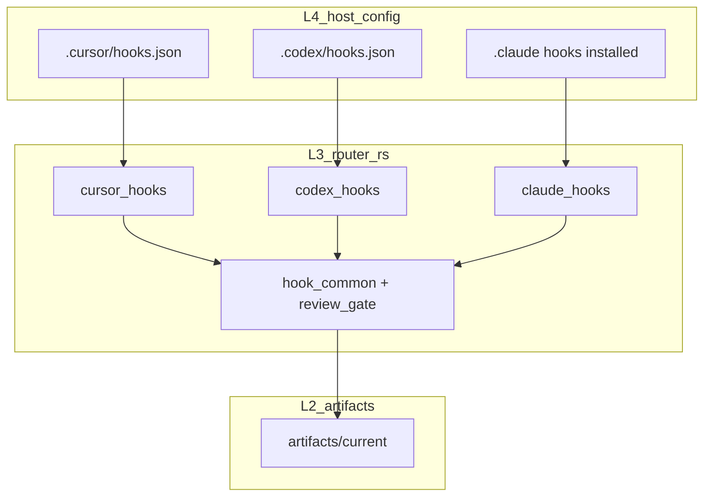

# 调研报告：框架真源（SSOT）与宿主投影层（全栈扫描）

**性质**：只读调研结论文档（对应 Cursor 计划「框架真源与宿主投影全栈调研」；**未**修改计划 `.plan.md` 文件本身）。
**证据时间**：以仓库当时磁盘状态为准；路径均相对仓库根。

**落地跟进（执行面，非本调研正文改写义务）**：`host_support.platforms` 已与 `RUNTIME_REGISTRY.host_targets.supported` 对齐并由 `skill-compiler-rs` 归一；见 `scripts/skill-compiler-rs/src/host_platforms.rs` 与 `tests/policy_contracts.rs` 中 **`runtime_host_support_platforms_are_registry_closed_and_match_skill_md`**。

**状态校准（2026-05-12）**：本文件保留当时只读调研记录；下文若仍出现 `host_support.platforms` 未闭环 / open gap 的表述，按本段视为**已解决的历史发现**。当前仍开放的是：`host_targets.supported`、`host_projections`、`framework_commands.*.host_entrypoints`、`SKILL_PLUGIN_CATALOG skills.<slug>.host_support.platforms` 四个集合的语义需在执行面持续保持清晰；profile payload 已改为从 `host_projections` 派生，同时保留 Codex 兼容输出。

---

## 0. 执行摘要

- **文档层 SSOT 叙事已存在**：`docs/harness_architecture.md` 五层模型、`docs/host_adapter_contract.md` North-star、`docs/host_adapter_contracts.md` Codex 投影边界，与「L2/L3 共享、L4 薄转发、宿主元数据在 `RUNTIME_REGISTRY`」一致。
- **路由热真源**：`skills/SKILL_ROUTING_RUNTIME.json`（`scope.kind=hot`，`hot_skill_count=25`，`fallback_manifest=skills/SKILL_MANIFEST.json`，`full_skill_count=51`）。`vnext` 指针聚合到 `SKILL_HEALTH_MANIFEST` / `SKILL_PLUGIN_CATALOG` / `SKILL_ROUTING_METADATA` / `SKILL_ROUTING_RUNTIME_EXPLAIN.json`。
- **编译器派生面**：`configs/framework/GENERATED_ARTIFACTS.json` 将多数 `skills/SKILL_*.json`、`SKILL_ROUTING_REGISTRY.md` 等标为 **skill-compiler-rs** 生成；`AGENTS.md` 与 `.codex/host_entrypoints_sync_manifest.json` 标为 **`router-rs codex sync`** 生成——这是 **策略/入口同步** 与 **路由编译** 两条不同流水线。
- **Codex 特化残留（预期内）**：`host_projections.codex-cli.session_supervisor_driver=codex_driver`；`$CODEX_HOME/skills` 仅 Codex 安装语义（`host_adapter_contract.md` 表）；`.codex/hooks.json` 为 bash 定位 `router-rs` 后调用 `codex hook`（较 Cursor 直接 argv 更厚，但仍以 L3 为语义核）。
- **`SKILL_PLUGIN_CATALOG skills.<slug>.host_support.platforms` 在 Rust 路由树中未检索到消费点**（`scripts/router-rs/src` 下对 `host_support` / `platforms` 字段无匹配）；**open gap**：若存在宿主过滤，可能在 **未检入的宿主侧** 或 **未来插件 ABI**；当前更似 **catalog/文档/安装投影元数据**。

---

## Q0 愿景对齐：SSOT vs 投影

| 层 / 面 | 真源（应保持唯一、可机器校验） | 投影 / 宿主私域（可再生、不承载第二套活路由） |
|--------|----------------------------------|-----------------------------------------------|
| L2 连续性 | `artifacts/current/*`、`configs/framework/*SCHEMA*.json` | 无（不应复制账本） |
| L3 控制面 | `scripts/router-rs`（门控、证据行、续跑合并） | 无 |
| 路由 / 注册 | `skills/SKILL_ROUTING_RUNTIME.json`、`configs/framework/RUNTIME_REGISTRY.json`、`skills/SKILL_MANIFEST.json`（fallback） | `$CODEX_HOME/skills/` 下 **投影后的** 路由副本（安装产物）；**不得**手改为主真源 |
| 策略叙事 | 仓库根 `AGENTS.md`（磁盘编辑真源） | Codex **编译期嵌入**快照；Cursor **`.cursor/rules/*.mdc`**（`framework install --to cursor`）；Claude `.claude/rules/framework.md` |
| L4 | N/A | `.cursor/hooks.json`、`.codex/hooks.json`、`router-rs claude hook` 绑定（stdin 透传） |
| L5 | `skills/**/SKILL.md` + RFV 等 reference | 宿主内「发现用」短描述；**不**复制整份路由表（`host_adapter_contracts.md` Hard Rules 6） |

**反模式（文档已禁止）**：在 hook shell / `.mdc` / skill prose 中复制 L3 门控或第二套 `EVIDENCE_INDEX` 规则（`harness_architecture.md` §2、`host_adapter_contract.md` §1）。

---

## Q1 路由 JSON 栈与 consumer 锚点

### 1.1 文件职责（11 个 `skills/SKILL_*.json`）

| 文件 | 角色摘要 |
|------|----------|
| `SKILL_ROUTING_RUNTIME.json` | **热路由入口**；`records`（25）+ 冗余 `skills` 行数组；含 `framework_command` 5 条 |
| `SKILL_MANIFEST.json` | **全量 skill 行**；runtime `scope.fallback_manifest` 指向之 |
| `SKILL_ROUTING_METADATA.json` / `SKILL_HEALTH_MANIFEST.json` | `records[].plugin.dependencies.runtime_refs` 引用 |
| `SKILL_PLUGIN_CATALOG.json` | 插件 ABI / 能力类；与 catalog 测试相关 |
| `SKILL_ROUTING_RUNTIME_EXPLAIN.json` | hot 外 slug 解释（见既有 `docs/plans/research_skills_hooks_survey.md`） |
| `SKILL_LOADOUTS.json` / `SKILL_TIERS.json` / `SKILL_SHADOW_MAP.json` | 派生/诊断；`policy_contracts` 与 `dead_code_subtraction_research_findings.md` 已记 **非热路由权威** |
| `SKILL_APPROVAL_POLICY.json` | 审批策略面 |
| `SKILL_SOURCE_MANIFEST.json` | skill-compiler 输入侧 |
| `SKILL_TIERS.json` | 同上 |

### 1.2 `host_support.platforms` 在 `records` 中的分布（量化）

- `("codex",)`：**20** 条（普通 `kind=skill` gate/owner）
- `("codex-cli","codex-app","cursor","claude-code")`：**5** 条（`kind=framework_command`：`autopilot`、`deepinterview`、`gitx`、`team`、`update`）

### 1.3 Consumer 锚点（节选，非穷举）

- `scripts/router-rs/src/skill_repo.rs`：`skills/SKILL_ROUTING_RUNTIME.json` + `AGENTS.md` 判定 policy root
- `scripts/router-rs/src/codex_hooks.rs`：保护性分类 `SKILL_ROUTING_RUNTIME.json` / `SKILL_MANIFEST.json` 等生成面
- `tests/host_integration.rs`：列路径 `SKILL_MANIFEST`、`SKILL_ROUTING_RUNTIME`、`SKILL_ROUTING_RUNTIME_EXPLAIN`、`SKILL_PLUGIN_CATALOG`、`SKILL_ROUTING_METADATA`、`SKILL_HEALTH_MANIFEST`、`SKILL_SHADOW_MAP`、`SKILL_APPROVAL_POLICY`
- `scripts/router-rs/src/eval_route.rs`、`route/records.rs`、`route/metadata_tests.rs`：路由评测/元数据
- `scripts/router-rs/src/host_integration.rs`：安装与 skill surface（多引用）
- `docs/rust_contracts.md`：fallback 不得引入第二路由权威（语义约束）

---

## Q2 `RUNTIME_REGISTRY` 与 `skills/` 从属

### 2.1 闭集宿主

`host_targets.supported`：**`codex-cli`**, **`codex-app`**, **`cursor`**, **`claude-code`**（与 `.codex/host_entrypoints_sync_manifest.json` 的 `supported_hosts` 一致）。

### 2.2 `host_targets.metadata`（精简）

| host id | install_tool | host_entrypoints |
|---------|--------------|------------------|
| codex-cli / codex-app | codex | AGENTS.md |
| cursor | cursor | AGENTS.md + `.cursor/rules/*.mdc` |
| claude-code | claude | AGENTS.md + `.claude/rules/framework.md` |

### 2.3 `host_projections`（3 键）

| 键 | host_id | transport / driver |
|----|---------|----------------------|
| codex-cli | codex | `native-codex`，`session_supervisor_driver=codex_driver` |
| cursor | cursor | `cursor-agent`，`session_supervisor_driver=unsupported` |
| claude-code | claude-code | `session_supervisor_driver=unsupported` |

### 2.4 `framework_commands`

与 `SKILL_ROUTING_RUNTIME` 中 5 个 `framework_command` slug 对齐样本：`autopilot`、`deepinterview`、`gitx`、`team`、`update`（`tests/policy_contracts.rs` 常量 `FRAMEWORK_COMMAND_IDS` 同集合）。

---

## Q3 全量 `SKILL.md` 普查（51 文件）

- **`find skills -name SKILL.md`**：**51**
- **含 `platforms:` 子串**：**47**
- **缺显式 `platforms:`**：**4** — `skills/hatch-pet/SKILL.md`、`skills/.system/skill-creator/SKILL.md`、`skills/.system/skill-installer/SKILL.md`、`skills/.system/plugin-creator/SKILL.md`（前两者正文仍大量出现「Codex」叙事词，属 **文档耦合** 非 JSON 元数据）

### 3.1 `metadata.platforms` 取值（grep `^  platforms:`）

- **`[codex]`**：绝大多数 hot manifest skill
- **`[codex, cursor]`**：`plan-mode`、`autopilot`、`update`、`loop`、`paper-workbench`、`code-review-deep`

### 3.2 与 runtime `host_support.platforms` 的「叙事冲突」

- **SKILL.md** 已标 `[codex, cursor]` 的 skill，在 **runtime `records`** 里仍多为 **`["codex"]` only**（例：`plan-mode`、`loop`）。结论：**frontmatter 更偏人类/多宿主说明；runtime 插件条目不自动一致**——若要以 SSOT 统一，需要 **execution** 阶段改 compiler/runtime 其一为生成源（本调研不选方案）。

---

## Q4 L4 Hook 盘点

### 4.1 Cursor（`.cursor/hooks.json`）

已注册事件（均指向 `router-rs cursor hook --event=…`）：`beforeSubmitPrompt`、`stop`、`sessionStart`、`sessionEnd`、`postToolUse`、`beforeShellExecution`、`afterShellExecution`、`afterFileEdit`、`preCompact`、`subagentStart`、`subagentStop`。
**形态**：直接 argv（无 bash 嵌套），stdin 由 Cursor 注入。

### 4.2 Codex（`.codex/hooks.json`）

事件：`PostToolUse`、`PreToolUse`、`SessionStart`、`Stop`、`UserPromptSubmit`。
**形态**：bash `-lc` 解析 `CODEX_PROJECT_ROOT`、探测 `router-rs` 路径后执行 `codex hook --event=…`；`PreToolUse`/`Stop`/`UserPromptSubmit` 在二进制缺失时 **fail-closed** JSON。

### 4.3 Claude Code

- **仓库内**：**未检入** `.claude/hooks.json`（本机由 `framework install --to claude` 写入；见 `host_adapter_contract.md` §2）。
- **模板**：`configs/framework/cursor-hooks.workspace-template.json` 服务 **Cursor** 工作区模板，非 Claude。

### 4.4 事件 × 宿主矩阵（简）

| 事件族 | Cursor | Codex | Claude（检入） |
|--------|--------|-------|----------------|
| 会话起止类 | sessionStart / sessionEnd | SessionStart | **open**：以安装为准 |
| Stop / 提交前 | stop / beforeSubmitPrompt | Stop / UserPromptSubmit | Stop 等 |
| 工具前后 | postToolUse 等 | PostToolUse / PreToolUse | PreTool / … |

---

## Q5 L3：`router-rs` hook 与分发（结构）

### 5.1 CLI 分发（`scripts/router-rs/src/cli/dispatch_body.txt`）

- `dispatch_codex_command`：`HookProjection`、`Sync`、`Check`、`Hook`、`HostIntegration`、`InstallHooks`
- `dispatch_cursor_command`：`Hook`
- `dispatch_claude_command`：`Hook`

### 5.2 模块级入口（grep 公开入口，节选）

| 模块 | 公开入口示例 |
|------|----------------|
| `codex_hooks.rs` | `build_codex_hook_manifest`、`build_codex_hook_projection`、`install_codex_cli_hooks`、`run_codex_audit_hook`、内部 `run_codex_pre_tool_use` / `run_pre_tool_use` |
| `cursor_hooks.rs` | `resolve_cursor_hook_repo_root`、（大文件内 `dispatch_cursor_hook_event` 等） |
| `claude_hooks.rs` | `run_claude_hook`、`run_claude_hook_cli` |
| `review_gate.rs` | Cursor review/subagent 状态机 |
| `hook_common.rs` | 共享启发式、工具名归一 |
| `host_integration.rs` | `framework install` / skill surface / 生成物 |

**mermaid（数据流，与文档一致）**



---

## Q6 注入与 review 信号真源

| 文件 | 读取方（锚点） | 备注 |
|------|----------------|------|
| `configs/framework/HARNESS_OPERATOR_NUDGES.json` | `harness_operator_nudges.rs`（`NUDGES_REL_PATH`）、`rfv_loop.rs`、`framework_runtime/continuity_digest.rs`、`framework_maint.rs` | 磁盘 + 内置默认合并；`ROUTER_RS_HARNESS_OPERATOR_NUDGES=0` 关闭 |
| `configs/framework/REVIEW_ROUTING_SIGNALS.json` | `review_routing_signals.rs` **`include_str!` 嵌入** | 编译进二进制；与磁盘漂移时以 **构建** 为准 |

---

## Q7 契约测试网（与「全 skill 扫描」差距）

| 测试文件 | 主要断言域 |
|----------|------------|
| `tests/policy_contracts.rs` | router-rs 编译、`FRAMEWORK_COMMAND_IDS`、manifest/runtime 对齐、生成物 tier/loadout、retired slug 集合等（**大文件**） |
| `tests/host_integration.rs` | 安装/生成路径、`SKILL_*` 列单、集成场景 |
| `tests/documentation_contracts.rs` | 文档链接与契约 |
| `tests/routing_eval_cases.json` | 路由评测用例（由 metadata_tests / eval_route 消费） |

**缺口**：**未**发现「逐条遍历 51 个 `SKILL.md` 与 `records` 双向一致」的单一测试；热集依赖 **compiler + policy_contracts** 组合闸。

---

## Q8 AGENTS.md 多路径与 Codex 嵌入

| 路径 | 真源角色 |
|------|----------|
| 磁盘 `AGENTS.md` | **编辑真源**（`AGENTS.md` 表「Codex hook 投影中的策略快照」行） |
| Codex 二进制嵌入 | **构建快照**；需 `cargo build …` + `router-rs codex sync`（同文件 §「Codex：`AGENTS.md` 构建快照」） |
| Cursor `.cursor/rules/*.mdc` | **托管差异子集**；**不**由 `codex sync` 管理（同表） |
| `.codex/host_entrypoints_sync_manifest.json` | 入口列表；与 `RUNTIME_REGISTRY` 推导一致（`host_adapter_contract.md` 文首） |

**漂移风险**：改 `AGENTS.md` 若未重建 router-rs + sync，Codex 侧仍可能消费 **旧嵌入**；Cursor 侧依赖 **framework install** 刷新 `.mdc`。

---

## Q9 差距矩阵（P0 / P1）与建议 execution 切片（不写 patch）

### P0（与「唯一真源 + 投影」张力最大）

1. **`SKILL.md` `platforms` vs `SKILL_ROUTING_RUNTIME.json` `host_support.platforms` 不一致**（多宿主叙事 vs 仅 codex 元数据）。
2. **`REVIEW_ROUTING_SIGNALS` 磁盘 vs `include_str!` 嵌入** — 编辑磁盘若不重编译，行为与「JSON 为 SSOT」直觉不一致（应以 **rust_contracts / 文档** 明示「构建真源」）。
3. **`GENERATED_ARTIFACTS` 将 `AGENTS.md` 列为 `codex sync` 生成** — 与日常「手编 AGENTS」并存；依赖 **discipline + sync**，易误解为「生成物可手改」。

### P1

1. **Codex L4 bash 较厚**（路径探测）vs Cursor 薄 argv — 维护成本高但非第二语义源。
2. **`host_support` 未在 Rust 路由中校验** — 多宿主声明可能 **仅装饰**；若产品上要 enforced，需新契约测试。

### 建议 execution 切片（下游计划可拆）

1. **元数据一致化**：以 compiler 从 `SKILL.md` 生成 `records[].host_support` 或反向校验（择一真源）。
2. **文档/契约澄清**：`REVIEW_ROUTING_SIGNALS`、嵌入策略、`AGENTS.md` 生成边界三页短补丁。
3. **单测补网**：`SKILL.md platforms` ⊆ runtime `host_support`（或显式例外表）。
4. **Claude L4**：将「安装后 hooks 列表」写入 `host_integration` 文档或 `GENERATED_ARTIFACTS` 扩面（若需可审计）。

---

## 附录 A：`SKILL_ROUTING_RUNTIME` 与 `GENERATED_ARTIFACTS` 交集

以下路径同时出现在 `GENERATED_ARTIFACTS.json` 的 generator 列表与 runtime 依赖中（**须走 skill-compiler 或 codex sync，勿手改为主流程**）：

`SKILL_MANIFEST.json`、`SKILL_ROUTING_RUNTIME.json`、`SKILL_ROUTING_RUNTIME_EXPLAIN.json`、`SKILL_PLUGIN_CATALOG.json`、`SKILL_ROUTING_METADATA.json`、`SKILL_HEALTH_MANIFEST.json`、`SKILL_SHADOW_MAP.json`、`SKILL_APPROVAL_POLICY.json`、`SKILL_LOADOUTS.json`、`SKILL_TIERS.json`、`FRAMEWORK_SURFACE_POLICY.json`、索引 md 等；另 **`AGENTS.md` + `.codex/host_entrypoints_sync_manifest.json`** 走 **`codex sync`**。

---

## 附录 B：验证命令（调研后可选复跑）

```bash
find skills -name 'SKILL.md' | wc -l
find skills -name 'SKILL.md' -exec grep -l 'platforms:' {} \; | wc -l
jq '.host_targets.supported' configs/framework/RUNTIME_REGISTRY.json
cargo test --manifest-path scripts/router-rs/Cargo.toml --quiet
```

（全量 `cargo test` 于仓库根可按 CI 需要再加。）
