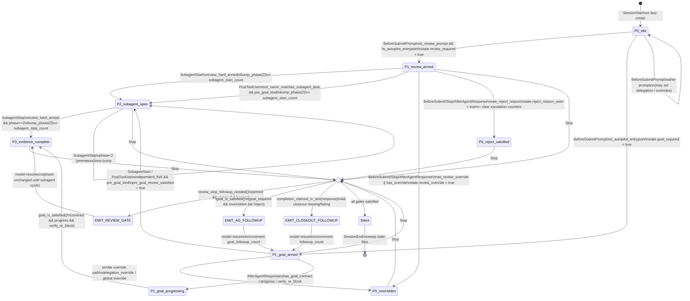

# Cursor Hook 深度调研报告

## 0. 摘要（TL;DR）

- 本仓 `.cursor/hooks.json` 把 **11 个** Cursor 事件 100% 转发给 `router-rs cursor hook --event=<EventName>`，事件名由 router-rs 在 `dispatch_cursor_hook_event` 中 trim + lowercase 后分发到 12 个 `handle_*` 函数（其中 `beforesubmitprompt` 与 `userpromptsubmit` 走同一分支）。详见 **D1**。
- 出站 JSON 字段在本仓主要使用 5 个键：`continue` / `permission` / `user_message` / `followup_message` / `additional_context`；续跑/门控类提示**默认**写入 `additional_context`，仅 `ROUTER_RS_CURSOR_HOOK_CHAT_FOLLOWUP=1` 等情况改写 `followup_message`。详见 **D2** 与 `router_env_flags.rs`。
- review/subagent 门控状态机以 `.cursor/hook-state/review-subagent-<session_key>.json` 为唯一持久层；`phase` 0→1→2→3 由 `beforeSubmit`（点燃 `review_required`）→ `subagentStart`/`PostToolUse`（armed 时 phase=2）→ `subagentStop`（armed 且 phase≥2 时 phase=3）推进；`Stop` 仅消费这份状态决定是否注入 `router-rs REVIEW_GATE / AG_FOLLOWUP / CLOSEOUT_FOLLOWUP`。详见 **D3**。
- 与官方 `create-hook` SKILL 的契约差异：本仓**未使用** `preToolUse / postToolUseFailure / beforeMCPExecution / afterMCPExecution / beforeReadFile / afterAgentThought / Tab*` 等事件；`afterAgentResponse` 在 `dispatch_cursor_hook_event` 已有 handler **但未在** `.cursor/hooks.json` 绑定（看似 dead-binding 的活分支）；`beforeSubmitPrompt` / `stop` / `preCompact` 出站字段 cheat-sheet 未明确列出，本仓视为 **未验证假设**。**D4 头号缺口**。

> **D4 头号发现（用作返回行）**：`afterAgentResponse` 在 router-rs 中已有完整 handler（更新 reject_reason / goal contract|progress|verify 信号），但仓库根 `.cursor/hooks.json` **没有绑定**该事件 → 在不主动 `dispatch` 该事件的 Cursor 版本下，对应的 goal-gate 信号采集**仅靠 `Stop` 上的兜底重扫**生效。这是当前实现与 hooks.json 绑定之间最显著的"潜在能力 vs 实际触达"差距。

---

## 1. 调研范围与边界

| 项 | 说明 |
|---|---|
| 范围 | Cursor 宿主侧 hook 契约 + 本仓 `router-rs cursor hook` 分发 / 出站 JSON / 状态文件 |
| 不在范围 | Codex / Claude 分支、cursor MCP 安装链、route_eval、autopilot 内部 RFV 算法（仅出现的字段） |
| 真源 | `.cursor/hooks.json`、`scripts/router-rs/src/cursor_hooks.rs`、`configs/framework/cursor-hooks.workspace-template.json`、`configs/framework/REVIEW_ROUTING_SIGNALS.json`、`scripts/router-rs/src/review_gate.rs`、`router_env_flags.rs`、`docs/host_adapter_contract.md`、`docs/harness_architecture.md`、`AGENTS.md` |
| 不修改 | `.cursor/plans/cursor_hook_深度调研_3da436b6.plan.md`（用户明令保护）、任何代码/hook 配置 |

**版本锚点**：调研日期 **2026-05-11**。`~/.cursor/skills-cursor/create-hook/SKILL.md` 为本机已安装的 Cursor 产品侧 skill 文档（无显式 Cursor 版本号；下文凡引用以"该 skill 当前版本"为隐含锚点；未来 Cursor 升级可能扩展事件/字段集，应再次 cross-check）。

---

## 2. 官方侧契约要点（基于 `~/.cursor/skills-cursor/create-hook/SKILL.md`）

> 引用源：本机 `~/.cursor/skills-cursor/create-hook/SKILL.md`（Cursor 安装时投影）。

### 2.1 schema

- 文件位置：项目级 `.cursor/hooks.json`（路径相对项目根） / 用户级 `~/.cursor/hooks.json`（路径相对 `~/.cursor/`）。
- 顶层：`{ "version": 1, "hooks": { <eventName>: [ <hookDef> ] } }`。
- `<hookDef>` 字段：`command`（shell 路径）、`type`（`command` | `prompt`，默认 `command`）、`timeout`（秒）、`matcher`（JavaScript-style regex）、`failClosed`（崩溃/超时/无效 JSON 时阻塞）、`loop_limit`（主要服务 `stop` / `subagentStop` follow-up 循环）。
- prompt 型 hook 字段：`type: "prompt"` + `prompt`（含 `$ARGUMENTS` 占位）。

### 2.2 官方枚举的事件集合（Agent + Tab）

| 类别 | 事件 |
|---|---|
| Session | `sessionStart`、`sessionEnd` |
| Tool 生命周期 | `preToolUse`、`postToolUse`、`postToolUseFailure` |
| Subagent | `subagentStart`、`subagentStop` |
| Shell | `beforeShellExecution`、`afterShellExecution` |
| MCP | `beforeMCPExecution`、`afterMCPExecution` |
| 文件 | `beforeReadFile`、`afterFileEdit` |
| 提示 | `beforeSubmitPrompt`（matcher 值固定为 `UserPromptSubmit`） |
| 压缩 / 完成 | `preCompact`、`stop` |
| 输出回放 | `afterAgentResponse`、`afterAgentThought` |
| Tab | `beforeTabFileRead`、`afterTabFileEdit` |

### 2.3 官方"事件输出字段 cheat-sheet"（直接拷自 SKILL.md "Event Output Cheat Sheet"）

| 事件 | 允许的出站字段 |
|---|---|
| `preToolUse` | `permission`、`user_message`、`agent_message`、`updated_input` |
| `postToolUse` | `additional_context`；MCP 工具时另含 `updated_mcp_tool_output` |
| `subagentStart` | `permission`、`user_message` |
| `subagentStop` | `followup_message` |
| `beforeShellExecution` / `beforeMCPExecution` | `permission`、`user_message`、`agent_message` |

**SKILL 未明确列出**：`sessionStart` / `sessionEnd` / `beforeSubmitPrompt` / `stop` / `preCompact` / `afterFileEdit` / `afterShellExecution` / `afterAgentResponse` / `afterAgentThought` / Tab 系列的允许字段集合。下文 D4 把这些标注为"未在 cheat-sheet 中验证"，需以本机 Cursor 行为或后续版本文档为准。

### 2.4 行为要点

- 退出码：`0` 成功；`2` 阻塞（同 deny）；其它非 0 默认 fail-open，除非 `failClosed: true`。
- Cursor 监听 `hooks.json` 变化并热加载；hooks 输出可在 Hooks 设置面板 / Hooks 输出通道排查。
- Matcher 是 JS 风格 regex，**不**支持 POSIX 字符类（`[[:space:]]` 必须改 `\s`）。

---

## 3. 本仓 hook 绑定与官方枚举的逐条对齐

数据来源：本仓 `.cursor/hooks.json` 已绑定事件 vs §2.2 官方枚举。

| 官方事件 | 本仓 `.cursor/hooks.json` 绑定 | 对齐状态 |
|---|---|---|
| `sessionStart` | ✓ `router-rs cursor hook --event=SessionStart`（timeout 5） | 一致 |
| `sessionEnd` | ✓（timeout 15） | 一致 |
| `beforeSubmitPrompt` | ✓（timeout 20） | 一致 |
| `stop` | ✓（timeout 20） | 一致 |
| `postToolUse` | ✓（timeout 60） | 一致 |
| `preToolUse` | ✗ 未绑定 | 仅本仓不用；router-rs **无** `handle_pre_tool_use` 分支 |
| `postToolUseFailure` | ✗ 未绑定 | 同上 |
| `subagentStart` | ✓（timeout 20） | 一致 |
| `subagentStop` | ✓（timeout 20） | 一致 |
| `beforeShellExecution` | ✓（timeout 15） | 一致 |
| `afterShellExecution` | ✓（timeout 15） | 一致 |
| `beforeMCPExecution` | ✗ 未绑定 | 缺口（未启用） |
| `afterMCPExecution` | ✗ 未绑定 | 缺口（未启用） |
| `beforeReadFile` | ✗ 未绑定 | 缺口（未启用） |
| `afterFileEdit` | ✓（timeout 10） | 一致 |
| `preCompact` | ✓（timeout 25） | 一致 |
| `afterAgentResponse` | ✗ 未绑定 | **router-rs 有 `handle_after_agent_response`，但 hooks.json 未拉起**（参见 D4） |
| `afterAgentThought` | ✗ 未绑定 | 缺口（未启用） |
| `beforeTabFileRead` / `afterTabFileEdit` | ✗ 未绑定 | 与 Agent 路径无关，预期不接入 |

---

## 4. D1 — 事件 ↔ CLI `--event=` ↔ `handle_*` 对照表

**入口链**：`.cursor/hooks.json` 的 `command` 字段 → `router-rs cursor hook --event=<Name> --repo-root <ROOT>` →（`scripts/router-rs/src/cli/dispatch_body.txt::dispatch_cursor_command` → `CursorCommand::Hook`）→ `scripts/router-rs/src/review_gate.rs::run_review_gate(event, …)` → `cursor_hooks::read_cursor_hook_stdin_json` 读 stdin → `cursor_hooks::resolve_cursor_hook_repo_root` 解析仓库根 → `cursor_hooks::dispatch_cursor_hook_event(repo_root, event, payload)` → 在内部对 `event.trim().to_lowercase()` 做 `match`。

> **关键事实**：`--event=` 实际值大小写不敏感（被 `to_lowercase` 归一化）。本仓 hooks.json 全部使用 PascalCase（`BeforeSubmitPrompt` 等），但用 camelCase / lowercase 同样能命中分支。

| hooks.json 事件键 | CLI `--event=` 实际值 | 归一化后 `match` 分支 | `handle_*` 入口 | 主要副作用 |
|---|---|---|---|---|
| `sessionStart` | `SessionStart` | `sessionstart` | `handle_session_start` | 注入项目 briefing；初始化 `.cursor/hook-state/session-terminals-<key>.json` baseline；读 `artifacts/current/SESSION_SUMMARY.md` 头部 + `GOAL_STATE` / `RFV_LOOP_STATE` 简报 |
| `beforeSubmitPrompt` | `BeforeSubmitPrompt` | `beforesubmitprompt` | `handle_before_submit` | 解析 review / delegation / autopilot 触发；推进 `review-subagent-<key>.json`；按需注入 pre-goal 提示与续跑 |
| **（同上）** | `UserPromptSubmit`（别名） | `userpromptsubmit` | `handle_before_submit`（同分支） | 与上面共用，对应 official `beforeSubmitPrompt` 的 matcher 值 |
| `stop` | `Stop` | `stop` | `handle_stop` | 消费状态：缺 review subagent 证据→ `REVIEW_GATE`；缺 goal → `AG_FOLLOWUP`；声明完成但缺 closeout → `CLOSEOUT_FOLLOWUP` |
| `postToolUse` | `PostToolUse` | `posttooluse` | `handle_post_tool_use` | 当工具是 subagent lane 时推进 phase；写 `EVIDENCE_INDEX.json`（验证类命令）；可选 rust-lint 注入 `additional_context` |
| `beforeShellExecution` | `BeforeShellExecution` | `beforeshellexecution` | `handle_before_shell_execution` | 入队 `pending_shells`（terminal 归属账本）；返回 `{"continue":true,"permission":"allow"}` |
| `afterShellExecution` | `AfterShellExecution` | `aftershellexecution` | `handle_after_shell_execution` | 配对 pending shell；扩展 `owned_pids` 账本；返回 `{}` |
| `subagentStart` | `SubagentStart` | `subagentstart` | `handle_subagent_start` | `active_subagent_count++`；armed 时 `bump_phase(2)` 与 `subagent_start_count++`；超并发上限时返回 `permission:"deny"` |
| `subagentStop` | `SubagentStop` | `subagentstop` | `handle_subagent_stop` | armed 且 phase≥2 时 `bump_phase(3)` 与 `subagent_stop_count++` |
| `afterFileEdit` | `AfterFileEdit` | `afterfileedit` | `handle_after_file_edit` | 仅对 `.rs` 文件调用 `rustfmt --edition 2021`；返回 `{}` |
| `preCompact` | `PreCompact` | `precompact` | `handle_pre_compact` | 写门控快照 + 上下文用量进 `additional_context` / `user_message`；可合并 RFV `precompact_hint` |
| `sessionEnd` | `SessionEnd` | `sessionend` | `handle_session_end` | 清扫 `.cursor/hook-state/` 中本模块前缀文件；终止本会话 terminal 账本登记的 PID |
| **（无 hooks.json 绑定）** | — | `afteragentresponse` | `handle_after_agent_response` | 仅在 review_gate disabled **以外**的路径里激活；解析 reject_reason / goal contract|progress|verify-or-block 信号写状态 |
| 其它未识别事件名 | 任何 | `_ => json!({})` | — | 安全 fallback：返回空对象，不影响会话 |

**`router-rs cursor hook --event=` 实参覆盖测试与代码事实**（直接证据）：
- `cli/args.inc` 定义 `CursorHookCommand { event: String, repo_root: Option<PathBuf> }`（行 333–338）。
- `cli/dispatch_body.txt::dispatch_cursor_command` 把 `CursorCommand::Hook(command)` 路由到 `run_review_gate(&command.event, command.repo_root.as_deref())`。
- `review_gate.rs::run_review_gate` 把 event 字符串直接传入 `dispatch_cursor_hook_event` 不做大小写转换；归一化发生在 `dispatch_cursor_hook_event` 自身。
- `dispatch_cursor_hook_event`（`cursor_hooks.rs` L3792–L3866）首先 `event_name.trim().to_lowercase()`，然后**根据 `cursor_review_gate_disabled_by_env()` 切到两套 match 表**：禁用时跳过 review gate 路径并保留续跑（`merge_continuity_followups_*`），常态下走完整门控。

---

## 5. D2 — 出站 JSON 字段 ↔ 用户/模型可见效果 ↔ `ROUTER_RS_*` 开关

### 5.1 字段使用矩阵（本仓实际写入 stdout 的键）

| 字段 | 出现位置（`handle_*`） | 语义 | 触发条件 |
|---|---|---|---|
| `continue` (bool) | `handle_before_submit`、`handle_before_shell_execution` | 是否放行（`false` 阻塞 / 短路） | beforeSubmit 锁不可用时按 `lock_failure_followup_for_before_submit` 决策；shell 阶段返回 `true` |
| `permission` (`"allow"` / `"deny"` / `"ask"`) | `handle_before_shell_execution`（`allow`）、`subagent_limit_denial`（`deny`，由 `subagentStart`/PostTool 触发）、`strip_cursor_hook_user_visible_nags` 例外保留 | 与官方一致 | shell 默认 allow；subagent 超并发上限 deny |
| `user_message` | `handle_pre_compact`（上下文用量横幅）、`subagent_limit_denial`（拒绝原因） | 面向用户 | preCompact 总是注入；subagent 拒绝时附带 |
| `agent_message` | 仓库未主动产出（仅由 `strip_cursor_hook_user_visible_nags` 保留通道） | 面向模型 | 当前实现未使用 |
| `followup_message` | `handle_stop`（REVIEW_GATE / AG_FOLLOWUP / CLOSEOUT_FOLLOWUP / hook-state lock 失败 / `paper_adversarial_hook`）、`handle_before_submit`（pre-goal 文案在 chat 模式下）、`handle_subagent_stop`（间接由 strip 例外保留）、应急 review gate disabled 路径的 closeout | 让模型在下一轮继续 | 默认**不**用此字段；`ROUTER_RS_CURSOR_HOOK_CHAT_FOLLOWUP=1`/`true`/`yes`/`on` 时改写它 |
| `additional_context` | `handle_session_start`（项目 briefing）、`handle_post_tool_use`（rust-lint 输出）、`handle_pre_compact`（门控快照）、`merge_continuity_followups`（AUTOPILOT_DRIVE / RFV_LOOP_CONTINUE 续跑块默认目标） | 注入上下文给模型而不在主对话区暴露 | 默认续跑/门控写这里 |
| `updated_input` / `updated_mcp_tool_output` | 仓库未使用 | 改写工具输入/输出 | preToolUse / postToolUse(MCP) 才有意义；当前 hooks.json 不绑定 |

### 5.2 字段 × 开关交叉表（哪些 `ROUTER_RS_*` 会改变上面这些字段的注入与否 / 形态）

> 默认语义复述：**未设置**视为启用；`0`/`false`/`off`/`no`（trim + ASCII 小写）才关闭——除非该开关明确"默认关闭 opt-in"。

| 开关 | 默认 | 影响的事件/handler | 对出站字段的可见效果 | 证据 |
|---|---|---|---|---|
| `ROUTER_RS_OPERATOR_INJECT` | 开 | beforeSubmit / Stop / 续跑链路、harness operator nudges、`PAPER_ADVERSARIAL_HOOK`（若启用） | **聚合关断**：续跑块与 nudge 全部消失，仅留硬阻塞 / 合规类提示 | `router_env_flags.rs` L84–95；`docs/harness_architecture.md` §8 L126 |
| `ROUTER_RS_AUTOPILOT_DRIVE_HOOK` | 开 | Stop 等的 AUTOPILOT_DRIVE 段 | 续跑块整体消失 | `autopilot_goal.rs` L18 `AUTOPILOT_DRIVE_HOOK_ENV`；harness §8 L128 |
| `ROUTER_RS_RFV_LOOP_HOOK` | 开 | Stop 等的 RFV_LOOP_CONTINUE 段 | 续跑块整体消失 | `rfv_loop.rs` L20 `RFV_LOOP_HOOK_ENV`；harness §8 L129 |
| `ROUTER_RS_AUTOPILOT_DRIVE_BEFORE_SUBMIT` | **关**（opt-in） | beforeSubmit 上是否合并 AUTOPILOT_DRIVE | 仅在显式开时 beforeSubmit 输出含 AUTOPILOT_DRIVE 段 | `router_env_flags.rs` L25–27、L131 |
| `ROUTER_RS_RFV_LOOP_BEFORE_SUBMIT` | **关**（opt-in） | beforeSubmit 上是否合并 RFV_LOOP_CONTINUE | 同上 | `router_env_flags.rs` L30–32、L132 |
| `ROUTER_RS_CURSOR_AUTOPILOT_PRE_GOAL_ENABLED` | **关**（opt-in） | beforeSubmit 的 `/autopilot` **pre-goal** 段与计数放行 | 关时 pre-goal 段不注入；不影响磁盘 `GOAL_STATE` 收口门控 | `router_env_flags.rs` L35–37、L133 |
| `ROUTER_RS_CURSOR_AUTOPILOT_PRE_GOAL_MAX_NUDGES` | unset → 默认 **8**；`0`/`false`/`off`/`no` 关闭自动放行 | `maybe_autopilot_pre_goal_nag_cap_release` | 达到上限时自动 `pre_goal_review_satisfied=true` 并注入"已达上限"放行文案 | `cursor_hooks.rs` L1770–L1820 |
| `ROUTER_RS_CURSOR_HOOK_CHAT_FOLLOWUP` | 关 | 所有续跑/门控注入位置 | 关：写 `additional_context`；开：写 `followup_message` | `router_env_flags.rs` L41–49 |
| `ROUTER_RS_CURSOR_HOOK_SILENT` | 关 | 所有 handler 出站（`strip_cursor_hook_user_visible_nags` / `apply_cursor_hook_output_policy`） | 整段剥离续跑/nudge；**例外保留**：含 `CLOSEOUT_FOLLOWUP` / `AG_FOLLOWUP` / `REVIEW_GATE` / `PAPER_ADVERSARIAL_HOOK` / `pre-goal 提示已达上限` / `hook-state 锁不可用` 字样的 followup | `cursor_hooks.rs` L1837–L1864；harness §8 L135 |
| `ROUTER_RS_CURSOR_REVIEW_GATE_DISABLE` | 关 | `dispatch_cursor_hook_event` 切到应急表 | 仅短路 review/delegation 门控；续跑仍合并；Stop 仍触发 closeout | `cursor_hooks.rs` L1828–L1835、L3799；harness §8 L136 |
| `ROUTER_RS_CURSOR_PAPER_ADVERSARIAL_HOOK` | **关**（opt-in） | beforeSubmit 论文类提示合并对抗短段 | 开且命中启发式时 followup/additional_context 含 `PAPER_ADVERSARIAL_HOOK` 段；受 `ROUTER_RS_OPERATOR_INJECT` 总闸约束 | `paper_adversarial_hook.rs` L6/L17；harness §8 L137 |
| `ROUTER_RS_CURSOR_MAX_OPEN_SUBAGENTS` | unset → 与运行时 `MAX_CONCURRENT_SUBAGENTS_LIMIT` 契约一致；`0` 关闭计数限流 | subagentStart | 超限时返回 `permission:"deny" + user_message`（包含建议关闭限流的文案） | `cursor_hooks.rs` L1865–L1892、L1924–L1934 |
| `ROUTER_RS_CURSOR_OPEN_SUBAGENT_STALE_AFTER_SECS` | 内置默认（见代码） | `reset_stale_active_subagents` | 超期 active subagent 不再阻塞新启动 | `cursor_hooks.rs` L1889–L1895 |
| `ROUTER_RS_CURSOR_SESSION_NAMESPACE` | unset → 用 session_id 或 cwd 派生 key | `session_key`（所有 hook 状态文件名） | 改变 `.cursor/hook-state/review-subagent-<key>.json` 的 `<key>` | `cursor_hooks.rs` L1040–L1050 |
| `ROUTER_RS_CURSOR_WORKSPACE_ROOT` | unset | `resolve_cursor_hook_repo_root` | 显式覆盖 `--repo-root` 与 stdin payload `cwd` | `cursor_hooks.rs` L1145–L1148 |
| `ROUTER_RS_CURSOR_KILL_STALE_TERMINALS` | 开 | SessionEnd `terminate_stale_terminal_processes` | 关闭后 SessionEnd 不杀 terminal PID | `cursor_hooks.rs` L3416、L3454–L3460 |
| `ROUTER_RS_CURSOR_TERMINAL_KILL_MODE` | `scoped`（默认）/ `legacy` / `all` / `repo` 等 | SessionEnd | 默认仅杀 `owned_pids` 账本；legacy 模式恢复全仓 active 扫描 | `cursor_hooks.rs` L1275–L1310（`cursor_terminal_kill_use_scoped_ownership`） |
| `CURSOR_TERMINALS_DIR` | unset → 派生 `$HOME/.cursor/projects/<mangled>/terminals` | SessionEnd / Shell handlers | 显式覆盖 terminal 列表目录（测试/定制用） | `cursor_hooks.rs` L3465–L3492 |
| `ROUTER_RS_CONTINUITY_POSTTOOL_EVIDENCE` | 开 | PostToolUse `try_append_post_tool_shell_evidence` | 关闭后 PostToolUse 不再追加 `EVIDENCE_INDEX.json` | `framework_runtime/mod.rs` L916、harness §8 |
| `ROUTER_RS_CONTINUITY_STOP_CHECKPOINT` | 开（Codex 路径） | Codex Stop 自动 in-progress checkpoint | Cursor Stop 与该开关无直接交互；列出避免误读 | `codex_hooks.rs` L915 |
| `ROUTER_RS_HARNESS_OPERATOR_NUDGES` | 开 | `harness_operator_nudges` 模块 | 关闭 RFV/Autopilot 续跑里来自 JSON 的 nudge 句；不影响 digest 主线 `深度信号` 行 | `harness_operator_nudges.rs` L4/L14；harness §8 L127 |
| `ROUTER_RS_GOAL_PROMPT_VERBOSE` | 关（紧凑） | autopilot / rfv / pre-goal 文案 | 切换 verbose vs compact 模板；与"是否注入"无关 | `router_env_flags.rs` L52–60；harness §8 L130 |
| `ROUTER_RS_DEPTH_SCORE_MODE` | `legacy` | `DepthCompliance` 第三分公式 | `strict` 时把 falsification_tests / 外研 strict 通过轮次计入第三分 | `router_env_flags.rs` L106–111；harness §8 L138 |
| `ROUTER_RS_CLOSEOUT_ENFORCEMENT` | 本地 unset → 软；CI 或显式非关闭值 → 硬 | `closeout_followup_for_completion_claim` | 决定 Stop 时声明完成但缺 closeout 是否注入 `CLOSEOUT_FOLLOWUP` | `cursor_hooks.rs` L227–L256；AGENTS.md "个人使用 / Closeout" |

> **rg 证据**：以上键名可用 `rg -n 'ROUTER_RS_CURSOR|ROUTER_RS_AUTOPILOT|ROUTER_RS_RFV|ROUTER_RS_HOOK_SILENT|ROUTER_RS_OPERATOR_INJECT|ROUTER_RS_CONTINUITY|ROUTER_RS_CLOSEOUT|ROUTER_RS_HARNESS_OPERATOR_NUDGES|ROUTER_RS_DEPTH_SCORE_MODE|ROUTER_RS_GOAL_PROMPT_VERBOSE' scripts/router-rs/src docs/` 复核（输出指向上表所列文件/行）。

---

## 6. D3 — review / subagent 门控状态机

### 6.1 状态持久化文件（`.cursor/hook-state/`）

| 文件 | 写入函数 | 字段要点 | 清扫时机 |
|---|---|---|---|
| `review-subagent-<session_key>.json` | `cursor_hooks.rs::save_state` (L1661) | `phase`(u32, 0..3)、`review_required` / `review_override` / `delegation_required` / `delegation_override` / `goal_required` / `goal_contract_seen` / `goal_progress_seen` / `goal_verify_or_block_seen` / `reject_reason_seen` / `pre_goal_review_satisfied` / `pre_goal_nag_count` / `active_subagent_count` / `active_subagent_last_started_at` / `subagent_start_count` / `subagent_stop_count` / `last_subagent_type` / `last_subagent_tool` / `lane_intent_matches` / `followup_count` / `review_followup_count` / `goal_followup_count` / `last_prompt` | SessionEnd 单文件精确删除 + 目录 sweep |
| `review-subagent-<session_key>.lock` | `acquire_state_lock` / `release_state_lock` | 文件锁 sentinel | 同上 |
| `session-terminals-<session_key>.json` | `save_session_terminal_ledger` | `version` / `baseline_pids` / `owned_pids` / `pending_shells` | 必须在 sweep 前读出（否则 sweep 会先删掉再读到空 ledger） |
| `adversarial-loop-<session_key>.json`（历史） | `remove_adversarial_loop` 仅清理 | 已废弃；保留路径用于 cleanup 不残留 | SessionEnd |
| `.tmp-<pid>-<micros>-review-subagent-<key>.json` / `.tmp-adv-loop-<pid>-<micros>` | `save_state` 原子写入失败遗留 | 孤儿临时文件 | SessionEnd（`review_gate_state_file_owned_by_module`） |

### 6.2 状态机图（mermaid）



### 6.3 关键函数索引（与上图节点对应）

| 节点 / 边 | 关键函数（`scripts/router-rs/src/cursor_hooks.rs`） |
|---|---|
| `BeforeSubmitPrompt` | `handle_before_submit`（L2155）、`is_review_prompt`、`is_autopilot_entrypoint_prompt`、`is_parallel_delegation_prompt`、`framework_prompt_arms_delegation`、`has_review_override`、`has_override`、`has_delegation_override`、`saw_reject_reason`、`maybe_autopilot_pre_goal_nag_cap_release` |
| `SubagentStart` | `handle_subagent_start`（L2287）、`subagent_limit_denial`、`reset_stale_active_subagents`、`fork_context_from_tool`、`counts_as_independent_context_fork`、`cursor_subagent_type_pair`、`pre_goal_subagent_kind_ok`、`review_hard_armed`、`bump_phase` |
| `SubagentStop` | `handle_subagent_stop`（L2346）、`review_hard_armed`、`bump_phase` |
| `PostToolUse` | `handle_post_tool_use`（L2384）、`tool_name_matches_subagent_lane`、`synthetic_post_tool_evidence_shape`、`try_append_post_tool_shell_evidence`、`maybe_run_cursor_rust_lint` |
| `AfterAgentResponse`（非 hooks.json 绑定，仅 dispatch 拉起） | `handle_after_agent_response`（L2632）、`hook_event_signal_text`、`has_goal_contract_signal`、`has_goal_progress_signal`、`has_goal_verify_or_block_signal`、`clear_review_gate_escalation_counters` |
| `Stop` | `handle_stop`（L2674）、`completion_claimed_in_text`、`closeout_followup_for_completion_claim`、`review_stop_followup_needed`、`review_stop_followup_line`、`goal_is_satisfied`、`goal_stop_followup_line`、`merge_continuity_followups`、`hydrate_goal_gate_from_disk` |
| `SessionStart` | `handle_session_start`（L3058）、`maybe_init_session_terminal_ledger`、`read_file_head_lines`、`read_json_value_strict` |
| `SessionEnd` | `handle_session_end`（L3302）、`sweep_review_gate_state_dir`、`review_gate_state_file_owned_by_module`、`terminate_stale_terminal_processes` |
| 续跑合并 | `merge_continuity_followups`（L51）、`merge_continuity_followups_before_submit`（L166）、`build_merged_continuity_block_for_before_submit`（L131）、`crate::autopilot_goal::merge_hook_nudge_paragraph` |
| 出站策略 | `strip_cursor_hook_user_visible_nags`（cursor_hook_silent 模式下保留例外）、`apply_cursor_hook_output_policy`、`scrub_followup_fields_in_hook_output`（`autopilot_goal`） |
| review 触发 regex | `scripts/router-rs/src/review_routing_signals.rs::review_gate_compiled_regexes`（来自 `configs/framework/REVIEW_ROUTING_SIGNALS.json`，13 条 regex；坏条目跳过，全坏回退内置 literals） |

### 6.4 文字流程（按事件时序）

1. **SessionStart**：写 `session-terminals-<key>.json` baseline；注入 briefing；不触动 review state（只 lazy 创建）。
2. **BeforeSubmitPrompt**：取 `prompt_text` + `hook_event_signal_text` → 检查 review / delegation / autopilot / override / reject_reason → 写 `review-subagent-<key>.json`（`save_state`）→ 仅在 pre_goal 缺失且 `ROUTER_RS_CURSOR_AUTOPILOT_PRE_GOAL_ENABLED` 显式开启时合并 pre-goal 段；按 `ROUTER_RS_AUTOPILOT_DRIVE_BEFORE_SUBMIT` / `ROUTER_RS_RFV_LOOP_BEFORE_SUBMIT` 合并续跑（默认关闭，跳过）；按 `ROUTER_RS_CURSOR_PAPER_ADVERSARIAL_HOOK` 合并论文对抗段。
3. **SubagentStart / PostToolUse**：在 review armed 时 `bump_phase(2)`；在 goal 需要 pre-goal 时若是 independent_fork 子代理 lane，把 `pre_goal_review_satisfied=true`。
4. **AfterAgentResponse**（仅当 hooks.json 已绑定时生效）：扫信号文本写 `goal_contract_seen / goal_progress_seen / goal_verify_or_block_seen / reject_reason_seen`。当前 hooks.json 未绑定，此采集只能依赖 Stop 再扫一次响应文本。
5. **SubagentStop**：在 review armed 且 phase≥2 时 `bump_phase(3)`。
6. **Stop**：四岔决策——
   1. 锁失败 → `lock_failure_followup_for_stop` + 续跑；
   2. 声明完成但缺 closeout → `CLOSEOUT_FOLLOWUP`（硬阻塞）；
   3. review 仍未满足 phase≥3 且未 reject → `REVIEW_GATE`；
   4. goal 仍未满足 → `AG_FOLLOWUP`；
   5. 全满足 → 静默或重置 state（仅当不再 `review_required` / `goal_required` / `reject_reason_seen` 时）。
7. **PreCompact**：仅作为快照写入门控信息 + 上下文用量横幅，**不**改变状态。
8. **SessionEnd**：先读 terminal 账本，再 `sweep_review_gate_state_dir`（前缀白名单），最后按账本/全仓策略 kill terminal。

---

## 7. D4 — 官方文档 vs 本仓实现 缺口清单

> 标记：**【一致】** 已在 SKILL.md / hooks 通用契约里被明确覆盖；**【扩展】** 仅本仓使用但与官方契约不冲突；**【未验证假设】** 行为依赖未被 SKILL.md cheat-sheet 直接列出的字段或事件；**【缺口】** 官方有该能力但本仓未启用。

### 7.1 事件层面

| 项 | 状态 | 备注 |
|---|---|---|
| 11 个绑定事件 vs §3 表 | 【一致】 | `version: 1` 与字段形态完全符合 SKILL.md |
| `afterAgentResponse` 在 router-rs 有 handler 但 `.cursor/hooks.json` 未绑定 | **【头号缺口】** | dispatch_cursor_hook_event L3860 `"afteragentresponse" => handle_after_agent_response`；不在 `.cursor/hooks.json` 的 hooks 字典里。结果：goal-gate 的 `goal_contract / progress / verify_or_block` 仅靠 Stop 时 `hook_event_signal_text(event, prompt, response_text)` 一次性补扫 |
| `preToolUse` / `postToolUseFailure` / `beforeMCPExecution` / `afterMCPExecution` / `beforeReadFile` / `afterAgentThought` 未启用 | 【缺口·有意】 | 本仓策略：避免向工具层注入策略 prose；保留以后扩展空间；非紧急 |
| `userpromptsubmit` 作为 `beforeSubmitPrompt` 的别名共享同一 handler | 【扩展】 | dispatch_cursor_hook_event L3854 `"beforesubmitprompt" \| "userpromptsubmit"`。官方 SKILL matcher 一节提到 `beforeSubmitPrompt` 的 matcher 值固定为 `UserPromptSubmit`；router-rs 把此值也当成事件名兜底 |
| `loop_limit` 字段在 `.cursor/hooks.json` 未声明 | 【未验证假设】 | router-rs 自己用 `state.followup_count` / `review_followup_count` / `goal_followup_count` 做局部计数限速；官方 `loop_limit` 默认值未知，未在 hook 定义里显式设置 |
| 所有 hooks 未设置 `failClosed: true` | 【一致】 | 与本仓 fail-open 原则一致：未编译的 router-rs 即"短路"通过；硬阻塞由 router-rs 返回内容决定 |

### 7.2 出站字段层面

| 字段使用 | 状态 | 备注 |
|---|---|---|
| `beforeShellExecution` → `{"continue":true,"permission":"allow"}` | 【一致】 | SKILL cheat-sheet 列 permission/user_message/agent_message；本仓仅写 permission |
| `subagentStart` → `{"permission":"deny","user_message":...}`（超并发） | 【一致】 | cheat-sheet 列 permission/user_message |
| `subagentStop` → 由 `strip_cursor_hook_user_visible_nags` 例外保留通道；handler 自身返回 `json!({})` | 【一致】 | cheat-sheet 列 followup_message |
| `postToolUse` → `additional_context`（rust-lint） | 【一致】 | cheat-sheet 列 additional_context |
| `beforeSubmitPrompt` → `{"continue": bool, "additional_context"|"followup_message"}` | **【未验证假设】** | SKILL cheat-sheet 未明确列出 `beforeSubmitPrompt` 允许字段；本仓依赖 Cursor 接受 `continue` + `additional_context` / `followup_message`。曾在生产中跑通，但官方 schema 文档未声明 |
| `stop` → `followup_message` / `additional_context` | **【未验证假设】** | cheat-sheet 把 `followup_message` 列在 `subagentStop`；`stop` 的 followup 字段名是否同名仅靠经验，请官方文档未来扩 cheat-sheet 时复核 |
| `sessionStart` → `additional_context` | 【未验证假设·惯例】 | cheat-sheet 无；社区 / SKILL 隐含支持，无负面证据 |
| `preCompact` → `additional_context` + `user_message` | 【未验证假设】 | cheat-sheet 无；preCompact 是否真正能向用户展示 `user_message` 待经验确认 |
| `afterFileEdit` → 不返回字段，仅 rustfmt 副作用 | 【一致】 | cheat-sheet 无字段；属于纯 side-effect 类 hook |
| `afterShellExecution` → `{}` | 【一致】 | 同上 |
| `updated_input` / `updated_mcp_tool_output` 未使用 | 【缺口·有意】 | 因未启用对应事件 |

### 7.3 与本仓既有契约文档的对齐情况

| 契约文档 | 引用要点 | 本报告印证 |
|---|---|---|
| `docs/host_adapter_contract.md` §2 Cursor 表（L70–L75） | review/subagent 门控、beforeSubmit/Stop 走 `review_gate::run_review_gate` → `dispatch_cursor_hook_event`；写盘 `.cursor/hook-state/review-subagent-*.json` | 完全印证（§4 D1 + §6 D3） |
| `docs/host_adapter_contract.md` §0 解耦原则 L24 | "宿主差异只允许停留在 L4 适配壳与 `RUNTIME_REGISTRY.host_targets` 元数据；L3 决策不复制" | `.cursor/hooks.json` 与 `cursor-hooks.workspace-template.json` 都遵守"短命 + 超时 + 仅 argv"；语义全部在 router-rs 内部 |
| `docs/host_adapter_contract.md` §3.2 L142 | `install_cursor_projection` **不**安装 hooks.json，仅 rules + MCP | 报告 §8 印证 |
| `docs/harness_architecture.md` §2.1 L41–L52 | review skill 路由 / 执行偏好 / REVIEW_GATE 三层 | 报告 §6 D3 印证 |
| `docs/harness_architecture.md` §8（开关表） | `ROUTER_RS_OPERATOR_INJECT` / `…_DRIVE_HOOK` / `…_LOOP_HOOK` / `…_HOOK_SILENT` / `…_REVIEW_GATE_DISABLE` 等 | 报告 §5 D2 完整覆盖 |
| `AGENTS.md` → **Host Boundaries** | Cursor hook 机读续跑短码（`AG_FOLLOWUP` / `REVIEW_GATE` / `AUTOPILOT_DRIVE` / `RFV_LOOP_CONTINUE` / `CLOSEOUT_FOLLOWUP`）真源在 hook 注入 | 报告 §6.3 与 §6.4 印证 |
| `AGENTS.md` → **Execution Ladder** | Cursor REVIEW gate 由 router-rs 维护独立 subagent 证据链 | 报告 §6 D3 印证 |

### 7.4 建议的"最小复现实验"（仅笔记，**不**改仓库）

> 目的：在不动 router-rs 与 `.cursor/hooks.json` 前提下，独立验证 SKILL.md cheat-sheet 未声明字段的实际行为。建议放进**临时**工作区（如 `/tmp/cursor-hook-echo/`）执行，结束后删除。

1. **临时 echo hook**（外部目录）：在 `/tmp/cursor-hook-echo/.cursor/hooks.json` 写一个对所有事件返回原 stdin + 时间戳的 shell hook（`jq` echo）。每事件触发后查看 Cursor "Hooks" output channel 与对话区表现，确认：
   - `beforeSubmitPrompt` 返回 `{ "continue": true, "followup_message": "..." }` 是否真在主对话区显示。
   - `stop` 返回 `{ "followup_message": "..." }` 是否进入下一轮 prompt（验证 SKILL.md 缺省 cheat-sheet）。
   - `preCompact` 返回 `{ "user_message": "..." }` 是否生成用户可见 banner。
   - `sessionStart` 返回 `{ "additional_context": "..." }` 是否进入第一条系统/工具上下文。
2. **重命名事件别名**：把同一脚本绑定到 `userpromptsubmit` 与 `beforeSubmitPrompt` 两个键，验证是否同 fire（确认本仓 dispatch 中"`userpromptsubmit` 兜底"的来源是宿主真发了这个事件名，还是 Cursor 内部规整后只发 `beforeSubmitPrompt`）。
3. **故意 stdout 非法 JSON + `failClosed: true`**：验证 `permission` / `failClosed` / 退出码 2 的具体行为对比，与本仓默认 fail-open 路径一致性。
4. **`loop_limit` 验证**：在临时 `stop` hook 上设置 `loop_limit: 2`，验证 follow-up 循环停止条件（router-rs 自有计数与官方 `loop_limit` 是否叠加 / 谁更短谁先 win）。

> 仅文本说明；上述实验**不**写入本仓任何 hook 配置或 router-rs 代码。

---

## 8. 安装链 / 模板对齐（install / template crosscheck）

| 维度 | 仓库根 `.cursor/hooks.json`（实际运行） | `configs/framework/cursor-hooks.workspace-template.json`（跨仓 bootstrap 模板） | `scripts/router-rs/src/host_integration.rs`（`framework install --to cursor`） |
|---|---|---|---|
| 启动命令前缀 | `${CURSOR_WORKSPACE_ROOT:-$PWD}/scripts/router-rs/target/release/router-rs cursor hook --event=…` | `"${ROUTER_RS_BIN:-router-rs}" cursor hook --event=…`（依赖 PATH） | **不**写 hooks.json |
| 触发事件 | 11 个（§3） | 11 个，与仓库根完全对齐 | — |
| timeout 数值 | beforeSubmit 20、stop 20、sessionStart 5、sessionEnd 15、postToolUse 60、beforeShell 15、afterShell 15、afterFileEdit 10、preCompact 25、subagentStart 20、subagentStop 20 | **完全一致** | — |
| `--repo-root` | `"${CURSOR_WORKSPACE_ROOT:-$PWD}"` | `"${CURSOR_WORKSPACE_ROOT:-$PWD}"` | — |
| 是否管理 hooks.json | 是（仓库根直接编辑） | 由 `scripts/cursor-bootstrap-framework.sh` 在目标项目 `.cursor/hooks.json` 写入此模板（`--force` 时覆盖） | `install_cursor_projection` 显式返回 `"hooks": {"managed": false, "reason": "not-enabled-by-framework-policy"}`（host_integration.rs L1672） |
| 投影写入物 | — | — | 仅 `framework.mdc`（project scope）/ `~/.cursor/rules/framework.mdc`（user scope）+ 用户级 MCP `browser-mcp`；不动 hooks |
| RUNTIME_REGISTRY 入口 | — | — | `host_targets.metadata.cursor.install_tool=cursor`、`host_entrypoints` 描述 framework.mdc 入口（`docs/host_adapter_contract.md` §0 表） |

**结论**：
- **模板（template）与仓库根 hooks.json 字段完全等价**，差异仅在 `command` 解析路径（仓库内绝对路径 vs PATH/`ROUTER_RS_BIN`）。两者同时维护时，跨仓 bootstrap 与本仓开发体验是一致的。
- **`framework install --to cursor` 显式不管 hooks**（见 `install_cursor_projection` 返回 `"hooks": {"managed": false, "reason": "not-enabled-by-framework-policy"}`）。所以"安装 hooks" 路径是 `scripts/cursor-bootstrap-framework.sh`（外部仓库）或人工拷贝 `.cursor/hooks.json`（本仓自身）。当前 `refresh_host_projections` 会刷新 Codex 入口同步与 project-scope Cursor / Claude 投影，但仍不安装 Cursor hooks。
- **细微 drift 风险**：若未来扩展事件，需要同时改三处的两处（仓库根 `.cursor/hooks.json` + `cursor-hooks.workspace-template.json`），host_integration.rs 不参与；任何只改其中之一都会让跨仓 bootstrap 与本仓行为分叉。建议在 `scripts/cursor-bootstrap-framework.sh` 中加一行 `cmp -s` 之外的**字段集合** diff（如 jq 比较 `hooks` 顶层 key 集合）以提早暴露 drift（属未来工程改进建议，本轮不实施）。

---

## 9. 复核命令（任何人都能跑）

> 仅 `rg` / `git status` 等只读命令，安全。**不**改任何文件。

```bash
# 1. 列出本仓所有 dispatch 分支与别名（包括 userpromptsubmit）
rg -n 'dispatch_cursor_hook_event|"sessionstart"|"beforesubmitprompt"|"userpromptsubmit"|"stop"|"posttooluse"|"subagentstart"|"subagentstop"|"beforeshellexecution"|"aftershellexecution"|"afterfileedit"|"precompact"|"sessionend"|"afteragentresponse"' \
  scripts/router-rs/src/cursor_hooks.rs

# 2. 所有 handle_* 入口
rg -n '^fn handle_' scripts/router-rs/src/cursor_hooks.rs

# 3. ROUTER_RS_* 开关命中
rg -n 'ROUTER_RS_CURSOR|ROUTER_RS_AUTOPILOT|ROUTER_RS_RFV|ROUTER_RS_HOOK_SILENT|ROUTER_RS_OPERATOR_INJECT|ROUTER_RS_CONTINUITY|ROUTER_RS_CLOSEOUT|ROUTER_RS_HARNESS_OPERATOR_NUDGES|ROUTER_RS_DEPTH_SCORE_MODE|ROUTER_RS_GOAL_PROMPT_VERBOSE' \
  scripts/router-rs/src docs/

# 4. 状态文件命名约定
rg -n 'review-subagent-|adversarial-loop-|session-terminals-|review_gate_state_file_owned' \
  scripts/router-rs/src/cursor_hooks.rs

# 5. install vs template 的命令前缀差异
diff <(jq -S . configs/framework/cursor-hooks.workspace-template.json) <(jq -S . .cursor/hooks.json) | head -80

# 6. host_integration 是否管理 hooks
rg -n 'managed.*false.*not-enabled-by-framework-policy|install_cursor_projection' \
  scripts/router-rs/src/host_integration.rs
```

---

## 10. 计划 vs 实际 / Git 收口 checklist（`/gitx plan` 由用户在 Cursor 宿主执行）

> 本调研报告**不**自行执行任何 git 变更；下面是给用户在 Cursor 宿主会话内调用 `/gitx plan` 时使用的对照清单（与 `skills/gitx/SKILL.md` 同契约）。

### 10.1 计划侧 todo 完成态对照

> 计划文件：`.cursor/plans/cursor_hook_深度调研_3da436b6.plan.md`（**只读**）。下面对照其 frontmatter `todos` 的 7 条进行完成态自检。

| 计划 todo id | 计划期望（精简） | 本报告交付位置 | 状态 |
|---|---|---|---|
| `host-contract` | 官方侧契约 + 与本仓 hooks.json 逐条对齐 | §2 + §3 表 | ✅ 完成 |
| `repo-dispatch-matrix` | D1 事件→handler 矩阵（含 `userpromptsubmit` 等别名） | §4 D1 | ✅ 完成 |
| `state-env-catalog` | D2 `.cursor/hook-state` + `ROUTER_RS_*` 开关影响表 | §5 D2 + §6.1 | ✅ 完成 |
| `review-state-machine` | D3 mermaid 状态机 + 关键函数 | §6 D3 | ✅ 完成 |
| `install-template-crosscheck` | 模板 ↔ 安装命令 ↔ 落地文件 三列对照 | §8 | ✅ 完成 |
| `doc-synthesis-deliverables` | 单文件大纲 + 引用 host_adapter_contract / harness_architecture | 本文件全部 | ✅ 完成 |
| `plan-vs-actual-gitx` | 逐项勾选 + 在 Cursor 内执行 `/gitx plan` 对照 | §10 本节 + 用户后续在 Cursor 跑 `/gitx plan` | ⚠️ 待用户执行 `/gitx plan` |

### 10.2 当前工作区 git 摘要（仅信息，非提交意图）

`git status --short` 摘要（在 `/Users/joe/Documents/skill` 内）：

- 本调研本轮**仅新增**：`docs/plans/cursor_hooks_deep_dive_research.md`（本文件）。
- 调研期间**未**修改任何 hook 配置、router-rs 源码、SKILL 路由。
- 既有脏文件（M / A / ?? 段）与本调研**无关**；如计划"git 收口"环节需要单独打包，请用户在 `/gitx plan` 中确认范围。

> **特别提示**：调研报告本身不应混进与 hook 调研无关的代码改动；若用户希望以本报告独立成 commit，建议 `git add docs/plans/cursor_hooks_deep_dive_research.md` 后再 `git commit`，与其余脏文件解耦。

### 10.3 `/gitx plan` 操作 checklist（用户在 Cursor 内执行）

- [ ] 在 Cursor 宿主当前会话中调用 `/gitx plan`（与 `skills/gitx/SKILL.md` 同契约）。
- [ ] 让 `/gitx plan` 自检本报告 §10.1 表中 7 条 todo 完成态。
- [ ] 让 `/gitx plan` 自检"是否仅本报告文件新增"（避免无关脏文件被纳入收口）。
- [ ] 若 `/gitx plan` 给出 commit 草稿：检查 commit message 是否覆盖"调研内容 + 不改 hook / 不改 router-rs"两点。
- [ ] **不**在未授权前 `git push`（与 `AGENTS.md` → Git 节一致）。

---

## 11. 相关文档与代码定位（便于后续 maintainer 跳转）

- 仓库根：`/Users/joe/Documents/skill/`
- 入口绑定：`.cursor/hooks.json`（11 事件）
- 跨仓模板：`configs/framework/cursor-hooks.workspace-template.json`
- bootstrap 脚本：`scripts/cursor-bootstrap-framework.sh`（将模板拷到目标项目）
- 核心实现：`scripts/router-rs/src/cursor_hooks.rs`（6325 行）
- 入口转发：`scripts/router-rs/src/review_gate.rs`、`scripts/router-rs/src/cli/dispatch_body.txt`、`scripts/router-rs/src/cli/args.inc`
- 开关聚合：`scripts/router-rs/src/router_env_flags.rs`
- review 触发 regex：`scripts/router-rs/src/review_routing_signals.rs` + `configs/framework/REVIEW_ROUTING_SIGNALS.json`
- 续跑文案：`scripts/router-rs/src/autopilot_goal.rs`、`scripts/router-rs/src/rfv_loop.rs`、`scripts/router-rs/src/paper_adversarial_hook.rs`
- 跨宿主契约：`docs/host_adapter_contract.md`、`docs/harness_architecture.md`、`AGENTS.md`（Host Boundaries / Execution Ladder）
- 官方 SKILL.md：`~/.cursor/skills-cursor/create-hook/SKILL.md`（本机安装的产品侧文档）

---

## 12. 已知风险与未解决问题

1. **Cursor 版本锚点未在 SKILL.md 中暴露**：当前 cheat-sheet 缺失多个事件（beforeSubmitPrompt / stop / preCompact / sessionStart / afterAgentResponse）的允许字段；本仓在生产中按惯例使用，未来 Cursor 升级若收紧字段白名单，部分续跑可能被丢弃（影响：续跑/门控变安静，但不影响硬阻塞）。**建议**：见 §7.4 的最小 echo 实验。
2. **`afterAgentResponse` 半连接**：handler 已实现却未在 hooks.json 绑定。若未来希望让 goal-gate 在 Stop 之前也能采集到 agent response 信号，需要在 `.cursor/hooks.json` 增 4 行（不在本轮范围）。
3. **`loop_limit` 未声明**：依赖 router-rs 自有 follow-up 计数 + Cursor 默认 `loop_limit`；后者数值未知。极端情况下可能让 follow-up 循环偏长或偏短。
4. **`failClosed: false`（默认）下** 若 router-rs 二进制缺失，所有 hook 静默 fail-open——这是有意为之（README/host_adapter_contract.md 已说明），但调试时可能被误以为"hook 没在用"。SessionStart 上 briefing 缺失就是最可见的 smoke signal。

---

（完。最后更新：2026-05-11；调研者：subagent 任务执行人。复核请按 §9 跑只读命令。）
