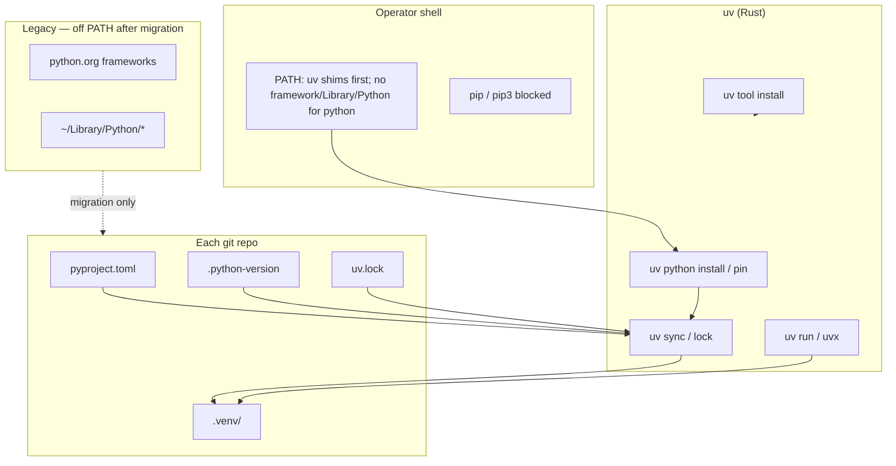

# Python Environment Management — Normative Specification

**Skill**: `python-env-management`  
**Version**: 1.1.1  
**Status**: normative for operator machines (macOS Apple Silicon primary)  
**Package manager**: [uv](https://docs.astral.sh/uv/) (Rust implementation by Astral) — **only**

This document is the single normative spec. Split references under `references/` are extracts for routing; on conflict, **this file wins**.

---

## 1. Scope

### 1.1 In scope

- Python **interpreter discovery and pinning** on macOS
- **Dependency installation, locking, and execution** via uv native commands
- **Shell PATH** and pip command suppression
- **Per-repository** layout (`pyproject.toml`, `.python-version`, `uv.lock`, `.venv`)
- **Migration** from python.org global installs and legacy `requirements.txt`
- **Health checks** and ongoing governance cadence
- **CI / hook** alignment for repos in this framework

### 1.2 Out of scope

- CUDA / Linux containers (covered only by analogy in `references/ci-contract.md`)
- Application runtime memory tuning → `mac-memory-management`
- Experiment random seeds, DVC, MLflow → `experiment-reproducibility`
- Publishing packages to PyPI (use `uv build` / `uv publish` when needed; not default)

### 1.3 Non-goals

- Supporting **pip** as an operator-facing tool
- Supporting **conda** unless a project explicitly documents an exception (default: no)
- Keeping **python.org 3.14** on default PATH (experimental; opt-in per invocation only)

### 1.4 Enforcement plane

| Layer | What it enforces | How |
|-------|------------------|-----|
| **Repo CI** (`skill-ci`) | Tracked skill bodies must not add operator `pip install` / `uv pip` / `python -m pip` (allowlisted normative negatives in this skill); framework repo uses `uv sync --frozen` + `uv run python` | `.github/workflows/skill-ci.yml` + `scripts/ci/check-skills-no-operator-pip.sh` |
| **Operator machine** | PATH, pip guards, uv-managed `python3` 3.12 | `scripts/health-check.sh` + shell profile contract (macOS; not run on ubuntu CI by default) |
| **Harness hooks** | — | python-env is **not** a PreToolUse gate; invoke **`$python-env-management`** explicitly for env work |

On conflict between this table and `AGENTS.md` one-liner, **this SPEC wins** for Python packaging semantics.

---

## 2. Design principles

| ID | Principle | Implication |
|----|-----------|-------------|
| P1 | **Single entry** | Python/pip resolution goes through **uv shims** in `~/.local/bin`; other PATH entries (Homebrew, npm, Cargo) may remain |
| P2 | **Single default series** | Global default **3.12** unless repo pins otherwise |
| P3 | **Project isolation** | No new packages in user/global site-packages |
| P4 | **Lock truth** | `uv.lock` is reproducible truth; `requirements.txt` is legacy input only |
| P5 | **Rust tool only** | uv implements resolution/install; **never** invoke `pip` binary — **except** §7 Phase 5 one-time archive via framework `python3.11` full path |
| P6 | **Explicit overrides** | `.python-version` per repo; no implicit “whatever python3 is” |
| P7 | **Fail closed** | Shell wrappers reject `pip` / `python -m pip` |

---

## 3. Architecture



**Storage layout (uv-managed)**

| Path | Purpose |
|------|---------|
| `~/.local/bin/uv` | uv binary and shims |
| `~/.local/share/uv/python/` | uv-downloaded CPython builds |
| `~/.local/share/uv/tools/` | `uv tool install` CLIs |
| `<repo>/.venv/` | Project virtualenv (gitignored) |
| `<repo>/uv.lock` | Committed lockfile |

---

## 4. Forbidden and required commands

### 4.1 Forbidden (operator)

**Exception (only):** §7 Phase 5 — `/Library/Frameworks/Python.framework/Versions/3.11/bin/python3.11 -m pip freeze` once before uninstall. No other `pip` / `python -m pip` use.

| Forbidden | Reason |
|-----------|--------|
| `pip`, `pip3` | Bypasses lock and project isolation |
| `python -m pip` | Same (see exception above) |
| `pip install --user` | Pollutes `~/Library/Python` |
| Global `python3 script.py` in a governed repo | May hit wrong interpreter |
| Adding python.org `Versions/*/bin` to PATH | Reintroduces dual stacks |

### 4.2 Required replacements

See [`references/command-matrix.md`](references/command-matrix.md). Native uv project API only:

| Intent | Command |
|--------|---------|
| Add dependency | `uv add <pkg>` |
| Remove dependency | `uv remove <pkg>` |
| Install from lock | `uv sync` |
| Refresh lock | `uv lock` |
| Run script | `uv run python path/to/script.py` |
| Run module | `uv run python -m pytest` |
| One-shot tool | `uvx <tool>` |
| REPL with deps | `uv run python` |
| Global CLI tool | `uv tool install <pkg>` |
| Export for audit | `uv export -o requirements-export.txt` (optional, not source of truth) |

### 4.3 Discouraged (compatibility layer)

| Command | Policy |
|---------|--------|
| `uv pip install ...` | **Do not use** in operator docs/skills; migrate to `uv add` / `uv sync` |
| `uv pip compile` | Replace with `uv lock` on `pyproject.toml` |

---

## 5. Shell profile specification

Normative detail: [`references/shell-profile.md`](references/shell-profile.md).

**Summary**

macOS zsh loads **both** `~/.zprofile` (login) and `~/.zshrc` (interactive). Cursor/Ghostty terminals are usually **interactive**; fixing only `.zprofile` is insufficient if `.zshrc` re-injects legacy Python paths.

1. **`~/.zprofile`**: Remove loops that prepend  
   `/Library/Frameworks/Python.framework/Versions/3.11/bin` and `.../3.14/bin`.
2. **`~/.zshrc`**: Fix the **entire** leading `export PATH=...` line — remove `$HOME/Library/Python/3.11/bin` (and any `Python.framework` segments), not a substring edit only.
3. **`~/.zprofile.local`** (normative template — includes pin + guards):
   - `uv python install 3.12` then `uv python pin --global 3.12` (once per machine)
   - Optional: `export UV_PYTHON_PREFERENCE=only-managed`
   - Prepend `~/.local/bin`; pip guard functions (see shell reference)
4. **Order**: `~/.local/bin` before Homebrew for Python; Homebrew `python@3.12` **not required on PATH**.
5. **Verify in a new interactive terminal** (not only login):

```bash
echo "$PATH" | tr ':' '\n' | grep -E 'Python.framework|Library/Python' && echo FAIL || echo OK
which python3; python3 -c 'import sys; print(sys.executable)'
```

---

## 6. Project contract

Normative detail: [`references/project-contract.md`](references/project-contract.md).

**Every governed Python repo MUST have**

| File | Committed | Role |
|------|-----------|------|
| `pyproject.toml` | yes | Declares `project.dependencies`, `requires-python` |
| `.python-version` | yes | Pin e.g. `3.12` (via `uv python pin`) |
| `uv.lock` | yes | Full resolution graph |
| `.venv/` | no (gitignore) | Created by `uv sync` |

**`requires-python`**

- Default new projects: `>=3.12,<3.13`
- Legacy import: match prior series (3.11) only until upgraded; then bump to 3.12

**Dev dependencies**

- Test/lint/format tools → `[dependency-groups] dev` (see `references/project-contract.md`)
- Add: `uv add --dev <pkg>`; install: `uv sync --all-groups` (or `uv sync --group dev`)

**Migration input**

- `requirements.txt` may exist temporarily; ingest via `uv add -r requirements.txt` once, then freeze into lock and stop editing requirements by hand.

---

## 7. Migration program

Normative phases: [`references/migration-runbook.md`](references/migration-runbook.md).

| Phase | Name | Exit criterion |
|-------|------|----------------|
| 0 | Stop-loss | No new global installs; pip aliases active; PATH audit clean or documented |
| 1 | PATH single-track | `which python3` → uv; `which pip3` → empty or blocked |
| 2 | Pilot repo | `made/code` or user-chosen repo: `uv sync` + `uv run` passes tests |
| 3 | All active repos | Each has `uv.lock`; docs/scripts use `uv run` |
| 4 | Legacy drain | No `Python.app` jobs on framework 3.11 unless intentional |
| 5 | Disk reclaim | python.org / `~/Library/Python` removed after 30-day quiescence |

**Running jobs**: Do not change PATH mid-flight on PIDs using old interpreter; wait for completion or kill explicitly.

**Phase 5 archive (pip exception)**: The only normative allowance for legacy `pip` is a **one-time** archive before uninstalling python.org: run `python3.11 -m pip freeze` **only** via the full path `/Library/Frameworks/Python.framework/Versions/3.11/bin/python3.11` (not guarded `python3`). Prefer `uv export` from already-migrated repos. Do not use this exception after Phase 5 completes.

---

## 8. CI and framework hooks

Normative detail: [`references/ci-contract.md`](references/ci-contract.md).

**GitHub Actions pattern**

```yaml
- uses: astral-sh/setup-uv@v5
  with:
    enable-cache: true
- run: uv sync --frozen
- run: uv run pytest
```

**Multi-Python CI matrix**: Use one `uv.lock` only when `requires-python` in `pyproject.toml` brackets all matrix versions (e.g. `>=3.11,<3.13`). Otherwise use separate branches or regenerate lock per series — `uv sync --frozen` will fail on the wrong interpreter.

**This repository (`skill`)**

- Root `pyproject.toml` + `uv.lock`; `.github/workflows/skill-ci.yml` uses `astral-sh/setup-uv@v5`, `uv sync --frozen`, and `uv run python` for hook tests. See [`references/ci-contract.md`](references/ci-contract.md) **Status** line.

---

## 9. Health check

**Script**: `scripts/health-check.sh`  
**Pass criteria**

| Check | Pass |
|-------|------|
| `command -v uv` | ok |
| `python3 --version` | 3.12.x |
| `sys.executable` | under `~/.local/share/uv/` (or equals `uv python find`) |
| `which pip3` | not found OR pip guard prints rejection |
| `uv python find` | resolves |
| `PATH` | **no** `Python.framework` or `Library/Python` segments (**FAIL** in health-check) |
| Heavy `Python.app` | informational only |

Run weekly or before starting long research jobs.

---

## 10. Governance cadence

| Interval | Action |
|----------|--------|
| Per clone / pull | `uv sync` |
| Per dependency change | `uv add` / `uv lock` + commit lock |
| Weekly | `scripts/health-check.sh` |
| Quarterly | `uv python upgrade 3.12`; per-repo `uv lock --upgrade-package <name>` as needed |
| After macOS major upgrade | Re-run Phase 1 PATH audit |

---

## 11. Disk and legacy interpreters

**Typical reclaimable (after migration)**

- `~/Library/Python/3.9`, `3.11`, `3.14`
- python.org `site-packages` under `/Library/Frameworks/Python.framework/` if uninstaller used

**Retain optionally**

- `/usr/bin/python3` (Xcode CLT) may remain on system PATH for Apple tooling — **do not use** it for research scripts or `uv run`; governed work uses project `.venv`
- Homebrew `python@3.12` — optional; redundant with uv

**uv cache**

- `~/.cache/uv` — safe to prune with `uv cache clean` if disk tight

---

## 12. Agent execution rules

When implementing this spec for a user:

1. Read `SPEC.md` + relevant `references/*` before editing shell or projects.
2. Never run `pip`, `pip3`, or `python -m pip` in commands shown to the user — **except** Phase 5 one-time archive via explicit framework `python3.11` path (§7).
3. Prefer `uv add` / `uv sync` / `uv run` in all examples.
4. Edit **both** `~/.zprofile` and `~/.zshrc` when fixing PATH; verify in a **new interactive** terminal.
5. Edit shell only with explicit user consent; provide rollback snippet.
6. Register skill changes via `framework skills refresh --write --write-companions`.
7. Cross-link `$mac-memory-management` only **after** env is uv-governed.

### 12.1 Framework skill alignment (required)

Normative audit list: [`references/framework-skill-audit.md`](references/framework-skill-audit.md).

**Already aligned:** `experiment-reproducibility`, `jupyter-notebook` (body).

**Cross-skill audit (2026-05-20):** All paths in [`references/framework-skill-audit.md`](references/framework-skill-audit.md) are **aligned**. Re-scan after skill edits; replacement pattern remains `uv add` / `uv sync` / `uvx` / `uv tool install` — never operator `pip` / `uv pip`.

### 12.2 Routing note

`python-env-management` lives on the **cold** manifest surface (not `SKILL_ROUTING_RUNTIME.json` hot rows). For governance tasks, users and agents should invoke **`$python-env-management`** explicitly to avoid generic routing drift.

---

## 13. Version history

| Version | Date | Change |
|---------|------|--------|
| 1.1.1 | 2026-05-20 | Round-2: PATH FAIL in health-check, pip exception cross-refs, framework audit list, runbook/shell/CI/dev-deps consistency |
| 1.1.0 | 2026-05-20 | Review fixes: dual-shell PATH, health-check uv path, Phase 5 pip exception, dev groups, CI matrix, cross-skill table |
| 1.0.0 | 2026-05-20 | Initial normative spec (uv-only, macOS) |
