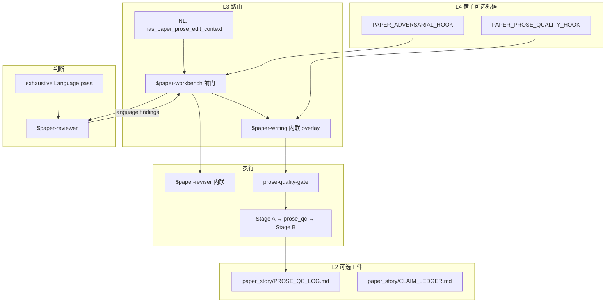

# Prose chain contract（科研写作全链路真源）

**目的**：把「写得差」从单点润色，收成 **可路由、可审稿、可改稿、可验收** 的闭环。  
**读者**：维护者、`$paper-workbench` 编排、`$paper-reviewer` / `$paper-writing` 实现方。

## 链路总览



## 阶段契约（按顺序，不可跳）

| 阶段 | Owner | 输入 | 输出 | 跳过条件 |
| --- | --- | --- | --- | --- |
| **0 路由** | router-rs + NL | 用户话术 / **粘贴手稿** / 口语改稿 | 命中 **`paper-workbench`**（`has_paper_prose_edit_context`；**无需**用户 token） | 用户显式仅工程/非手稿 |
| **1 Intake** | `$paper-workbench` | 任务 + 稿件片段 | `language_register` + `edit_scope` + `scope_items` + Claim card（四槽） | 词/单句级 + `writing_mode: sentence-only` |
| **2 科学栏** | `$paper-reviewer` / exhaustive | 手稿 | verdict + `findings_by_dimension.language[]`（含 `prose_repair_class`） | 用户仅润色且 claim 已冻结并写明 |
| **3 改稿** | `$paper-reviser` 内联 | findings + R&R | 结构/证据改动 + `change_id`；触句时同阶段 4 | 无结构改动、仅 prose |
| **4 写作** | `$paper-writing` 内联 | 冻结 claim + scope | `tone_audit` + **`prose_qc`** + Stage B 正文 | 仅 Stage A 提纲轮 |
| **5 验收** | `$paper-workbench` 收口 | 4 的交付 | 用户可见：register → 检视 → 正文；可选写入 `PROSE_QC_LOG` | 单轮对话不收口 |

## `language_register`（全链必传）

| 值 | 路由/审稿/写作 |
| --- | --- |
| `en_submission` | EN slop + Gopen + Cadence |
| `zh_manuscript` | ZH 套话 + 段首句 + 衔接 |
| `mixed` | 按 `scope_items` 分 surface；findings 须标 `register` |

机器 token：`language_register: …`（单独一行）。下游 lane **不得**改写上游未传的 register。

## 审稿 → 写作 handoff（`language` finding 形状）

`$paper-reviewer` / exhaustive **language** 维度每条 finding **应**含：

```text
id: L-###
severity: A|B|C|Warning
location: § / 段 / 句锚点
issue: <读者可见问题>
prose_repair_class: slop_zh | slop_en | topic_sentence | ladder_blocked | cadence | defensive_tone | terminology | citation_cluster | other
register: en_submission | zh_manuscript | mixed
suggested_fix: <一句可执行方向，非整段代写>
writing_handoff: surgical | refactor  # 若需多段/全节骨架重组
```

`$paper-workbench` 转发 `$paper-writing` 时须附上：**未关闭的 L-* findings** + `writing_mode: ladder-full`（除非 sentence-only）。

## 写作门控（执行真源）

- 门控：[`../../paper-writing/references/prose-quality-gate.md`](../../paper-writing/references/prose-quality-gate.md)
- 范例：[`../../paper-writing/references/prose-exemplars.md`](../../paper-writing/references/prose-exemplars.md)
- 姿态/术语：[`research-language-norms.md`](research-language-norms.md)

**硬规则**：未 `ladder_passed: L1–L4` 不得交付长段 Stage B；`prose_qc` 与 `tone_audit` 不得合并省略。

## L2 可选工件（多轮）

| 路径 | 用途 |
| --- | --- |
| `paper_story/CLAIM_LEDGER.md` | claim 天花板（已有约定） |
| `paper_story/PROSE_QC_LOG.md` | 每轮 `prose_qc` 摘要 + slop_hits + ladder 状态 |
| `paper_story/TERMINOLOGY_GLOSSARY.md` | 术语冻结 |

模板：[`templates/PROSE_QC_LOG.template.md`](templates/PROSE_QC_LOG.template.md)

与 harness `artifacts/current/<task_id>/EVIDENCE_INDEX`：**正交**；手稿 prose 关停以 `PROSE_QC_LOG` + 用户确认为主，不要求 RFV PASS。

## L4 宿主短码（per-host）

**L3 skill + NL 路由跨宿主**；**L4 短码**仅在具备 `UserPromptSubmit` / `beforeSubmit` 的宿主注入（Cursor、Codex CLI、Claude Code、Antigravity CLI）。`claude-desktop`、`codex-app`、`antigravity-app` 无 UPS hook —— 仅 skill/NL。

| 文件 | 环境变量（prose **默认开**） | 注入事件 |
| --- | --- | --- |
| `configs/framework/PAPER_PROSE_QUALITY_HOOK.txt` | `ROUTER_RS_CURSOR_PAPER_PROSE_HOOK` | Cursor `beforeSubmit` |
| 同上 | `ROUTER_RS_CODEX_PAPER_PROSE_HOOK` | Codex CLI `UserPromptSubmit` |
| 同上 | `ROUTER_RS_CLAUDE_PAPER_PROSE_HOOK` | Claude Code `UserPromptSubmit` |
| 同上 | `ROUTER_RS_ANTIGRAVITY_CLI_PAPER_PROSE_HOOK` | Antigravity CLI `UserPromptSubmit` |
| `configs/framework/PAPER_ADVERSARIAL_HOOK.txt` | `ROUTER_RS_*_PAPER_ADVERSARIAL_HOOK=1`（四宿主对称；**默认关**） | 同上 |

触发单真源：`has_paper_prose_edit_context`（hook 与 NL 共用）。受 `ROUTER_RS_OPERATOR_INJECT` 总闸约束；出站截断保留 `PAPER_*` 前缀行。实现：`core/router-rs/src/paper_prose_hook.rs`、`hook_outbound_protect.rs`。

## 与 `$research-workbench` 边界

非手稿科研 → `$research-workbench`。若产出需落笔（讨论稿/开题叙述），handoff：

```text
handoff: paper-workbench
language_register: zh_manuscript | en_submission
note: claim/evidence 来自 research 工件，勿在 writing 轮发明新结果
```

## 维护检查清单

- [ ] NL：`has_paper_prose_edit_context` → boost `paper-workbench`；`has_paper_writing_context` 仅作辅助 boost（不直跳 `paper-writing` 热入口）
- [ ] `user-phrases-to-lanes`：「润色」→ workbench intake
- [ ] reviewer language findings 含 `prose_repair_class`
- [ ] writing 交付含 `prose_qc`
- [ ] hook txt 与 skill 引用路径一致
