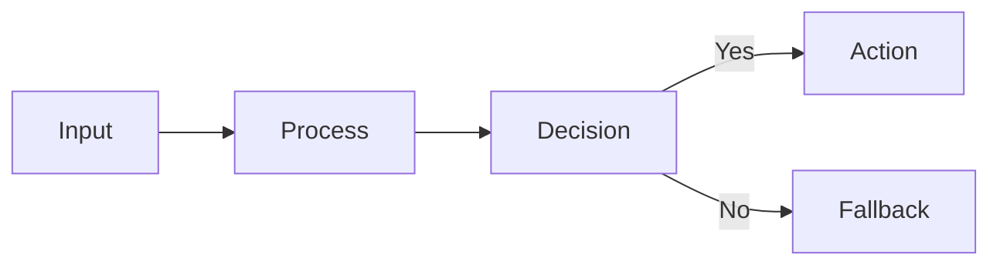

# Beamer Workflow

Use this reference when creating a Beamer deck from scratch or when the main problem is visual or compile quality rather than content planning.

## Project Skeleton

Start with:

- `main.tex`
- `assets/`
- `build/`
- `scripts/` if you want the build helpers copied into the project
- `sources.md`
- `refs.bib` if citations are needed

Keep generated files in `build/` so the working tree stays readable.

## Engine Decision

- Use XeLaTeX for Chinese, mixed-language, or system-font workflows.
- Use LuaLaTeX when XeLaTeX is unavailable and package compatibility is acceptable.
- Use pdfLaTeX only for simple Latin decks with standard packages and no CJK requirements.

Prefer `beamer` plus `ctex` when the deck should inherit an existing Chinese report or thesis style. Use `ctexbeamer` only when a lighter preamble is more important than style continuity.

## Visual System First

Before writing dense slide content, define the reusable visual system:

- cover slide treatment
- content footline treatment
- semantic color roles
- emphasis box system
- closing slide treatment

Read [design-system.md](./design-system.md) when the request involves theme polish, template upgrades, or a check for whether presentation details were fully implemented.

Do this early because late-stage footline or color rewrites often cascade into spacing regressions across the whole deck.

Default house style in this skill:

- deep navy title band across content frames
- white canvas and generous whitespace
- muted blue accent for footline center segments and secondary structural bars
- warm gold reserved for a small number of highlight cards or takeaway boxes
- pale neutral blocks instead of saturated cards
- low three-zone footline
- centered cover card and a matching Q&A or closing frame
- two-level cover hierarchy by default: title plus subtitle, then compact presenter metadata
- readable body type that survives PDF export and screenshot review
- content frames that feel substantial rather than visually under-filled

If the user gives a reference PDF that clearly establishes another style, match that style instead of forcing the default.

## Frame Design Rules

- Give each frame one message, not one topic bucket.
- Use short bullets that read as claims, not sentence fragments waiting for narration.
- Prefer restrained academic layout over startup-pitch ornamentation.
- Set typography before micro-layout fixes:
  - prefer `12pt` Beamer base size by default
  - keep ordinary body text near `\normalsize` or `\large`
  - avoid letting important explanatory text collapse into `\small` unless the frame is already information-dense and still clearly readable
- Keep titles and subtitles short enough that, if they wrap, the lines still look balanced. Rewrite a heading if the second line turns into a tiny tail.
- For Chinese or mixed-language text, avoid leaving one or two Han characters on a line. Also avoid splitting year markers, percentages, numeric-unit pairs, English terms, citation brackets, or parenthetical phrases unless there is no cleaner layout fix.
- If a frame needs more than one visual hierarchy level, make the second level visibly smaller or lighter instead of adding another block at equal weight.
- Separate completed evidence from planned work. A frame may present setup, method, dataset, hypothesis, or evaluation design without pretending the result already exists.
- Protect the bottom safe area early. Leave room for source notes, captions, and footlines instead of discovering the collision only after the slide is full.
- For two-column frames, balance both information weight and whitespace. If one column becomes much denser, change the structure or split the frame rather than accepting a lopsided composition.
- Turn dense explanatory frames into one of these shapes before shrinking text:
  - left narrative, right evidence
  - top claim, bottom comparison
  - figure with takeaway strip
  - 2-column contrast
  - summary metric row plus detail bullets
- If a frame feels empty after layout, add one more structured evidence layer instead of leaving decorative blank area:
  - compact metric row
  - interpretation strip
  - side takeaway panel
  - small comparison card
  - source-backed annotation

## Evidence Discipline

- Never invent experiment outputs, benchmark numbers, ablation wins, p-values, rankings, or error bars.
- If the user has not produced a result, keep the slide honest:
  - present the experiment design
  - present the metric definition
  - present the evaluation protocol
  - present a blank or placeholder result table clearly labeled as pending
- Do not convert expectations into conclusions. Use labels such as `Planned Evaluation`, `Pending Result`, `Hypothesis`, or `To Be Measured`.
- If a figure or table would otherwise look empty, restructure the frame around method, rationale, or next-step interpretation instead of filling cells with fake values.

## Tables And Figures

- Crop or simplify figures before importing them.
- Avoid full-width raw tables unless the slide is a table-first appendix page.
- Emphasize key rows or columns with weight or color instead of keeping every cell equally prominent.
- Keep captions and source lines short; long source notes belong in `sources.md`.
- When using the default house style, place figures and diagrams inside the same pale-panel system as the text so visual language stays consistent.
- For tables, shorten headers, reduce the number of visible comparison columns, or move raw detail to appendix frames before shrinking the table.
- For equation-heavy slides, move derivation detail to backup frames or split notation from the main takeaway before making the formula block too small to read.

## Compile Loop

Either invoke the bundled build script from the skill folder with the deck root as the working directory, or copy it into the deck's `scripts/` directory and run it locally. The examples below assume the script has been copied into the project:

```bash
./scripts/build_beamer.sh main.tex
```

Useful variants:

```bash
./scripts/build_beamer.sh slides.tex --engine lualatex
./scripts/build_beamer.sh main.tex --clean
./scripts/build_beamer.sh main.tex --outdir build
```

Then summarize the log before visual review:

```bash
./scripts/check_beamer_log.sh build/main.log
```

Inspect:

- hard compile failures
- missing files
- undefined references or citations
- overfull `\\hbox` and `\\vbox`
- theme regressions after package changes

Treat the log as a weak signal, not a final verdict. Beamer can still produce:

- overlapping `tcolorbox` or `columns` content
- figures that extend below the visible frame
- clipped equations or tables
- footers colliding with body content

without a decisive overfull warning.

## Visual QA

Compile first, then render PNG thumbnails if page-by-page inspection is easier than reading the PDF directly:

```bash
./scripts/render_slides.sh build/main.pdf
```

If the deck has many pages, generate a lightweight review gallery:

```bash
python3 ./scripts/build_review_html.py build/slides-pages
```

Check for:

- clipped content near the bottom edge
- lines that leave only one or two Chinese characters by themselves
- titles or subtitles with a visibly tiny trailing line
- plain-frame footer bars that sink into the page edge or viewer chrome
- unreadable legends or axis labels
- inconsistent title placement
- awkward whitespace
- footers colliding with content
- body frames whose content mass is visibly shoved too far left
- cover slide hierarchy that still looks like the stock Beamer title page
- cover slides with too many competing text lines above the metadata block
- inconsistent footline styling across supposedly matching content frames
- arbitrary color changes that break the semantic palette
- any reversion to stock `Madrid`-style palette bars or decorative box treatments that no longer match the house style
- callout boxes that change styling without changing meaning
- a missing or under-designed closing slide
- frames that look empty because the content structure is too thin
- frames whose body text is technically present but too small relative to the surrounding whitespace
- overlapping boxes or text baselines
- figures that are technically present but visually exceed the safe area
- mixed-language tokens split in awkward places
- columns that are technically aligned but visually lopsided

Do not sign off based only on the TeX log. Call `$visual-review` on the rendered PNG pages and pass:

- `target issue`: overlap, clipping, unreadable labels, weak hierarchy, or render bug
- `artifact scope`: page numbers or page range
- `decision lens`: presence check or sign-off gate
- `output need`: `E. Targeted audit`

Use the resulting verdicts to decide which frames need source fixes.

Typography and density sign-off questions:

- Can the main body text be read comfortably from the rendered PNG without zooming?
- Does the frame look like a complete information unit rather than a title over a large blank canvas?
- If the frame feels sparse, should it gain another structured panel before approval?
- Does any heading, caption, or bullet wrap in a way that leaves a tiny final line or only one or two Chinese characters alone?

## Diagram Strategy

Prefer a 3-step path for ordinary flowcharts and process diagrams:

1. Write the diagram in Mermaid text.
2. Render it to local SVG or PDF assets.
3. Embed the rendered asset in Beamer with `\\includegraphics`.

Use this path for:

- workflows
- pipelines
- architecture overviews
- branching decision flows
- sequence-like diagrams that do not require publication-grade TikZ control

Prefer Mermaid because it is cheaper in tokens and easier to iterate than raw TikZ for most deck diagrams.

Decision rule:

- use Mermaid for standard flowcharts, pipelines, decision trees, or architecture boxes
- use plain Beamer bullets plus one metric row if the diagram would only restate a simple sequence
- use TikZ only when the geometry itself is part of the message or strict TeX-native control is required

Use raw TikZ only when:

- the user explicitly wants TikZ-native source
- the figure depends on precise TeX math layout inside nodes
- the deck already contains a matching TikZ diagram system
- Mermaid cannot express the required geometry cleanly

Typical workflow:

```bash
cat > assets/flow.md <<'EOF'

EOF

./scripts/render_mermaid.sh assets/flow.md --outdir assets/diagrams
```

Then include the result in Beamer:

```tex
\includegraphics[width=\linewidth]{assets/diagrams/flow.pdf}
```

## Citation Practice

- Keep a `sources.md` log even when using BibTeX.
- Cite external images near the figure or in speaker-facing notes if the deck style permits it.
- Cite quantitative claims in the frame body or footline area when the claim may be questioned.

## Delivery

Deliver:

- `main.tex`
- `build/main.pdf` or the chosen compiled PDF
- `assets/`
- `sources.md`
- `refs.bib` when used

Do not deliver only the PDF if the user asked for a reusable Beamer deck.
