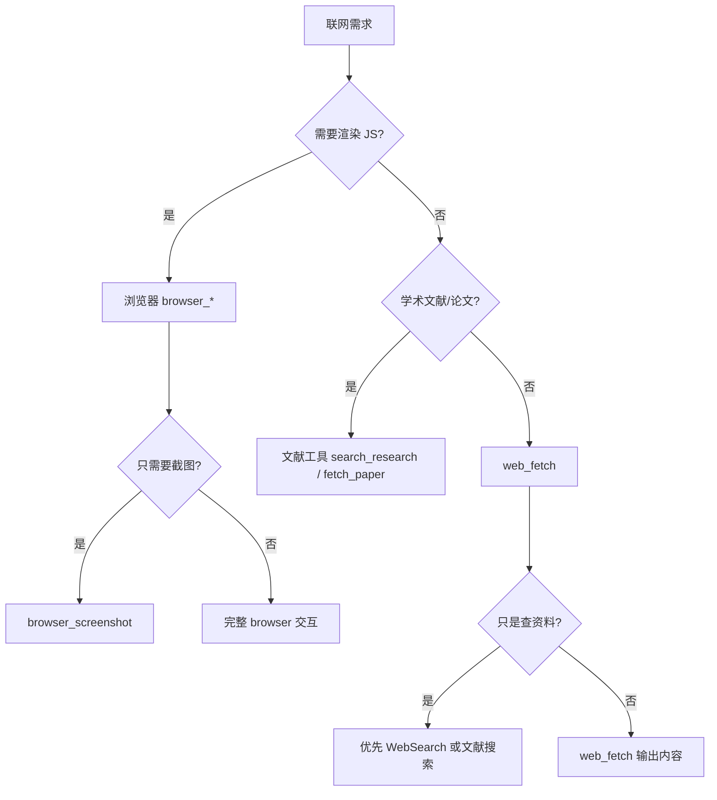

---
allowed_tools:
- shell
- browser
approval_required_tools: []
description: '通用联网工具 — web_fetch（简单 HTTP 抓取）、browser（交互式浏览器）、文献调研工具。自动判断使用 web_fetch 还是 browser，解决"怎么拿这个页面/数据"问题。'
metadata:
  platforms:
  - supported
  tags:
  - web
  - browser
  - automation
  - screenshot
  - scraping
  - literature
  version: '1.1.0'
name: web-tools
network_access: required
routing_gate: none
routing_layer: L3
routing_owner: owner
routing_priority: P2
risk: low
scene: general
session_start: n/a
short_description: 通用联网工具 — web_fetch 抓取、浏览器操作、文献调研一体化
tags:
- web
- browser
- automation
- web-scraping
- screenshot
- literature
trigger_hints:
- 抓取
- 联网
- 爬虫
- web
- fetch
- browser
- automation
- screenshot
- 浏览器
- 截图
- 截屏
- 打开网页
- 点击
- 表单填写
- 输入
- 网络请求
- network
- 页面状态
- 页面元素
- 页面文本
- 浏览器会话
- 等待
- 自动填充
- 网页抓取
- web scrape
- 网络监听
- 网页操作
- 网页内容
- 获取网页
- 爬取
- 网络调研
- 查资料
- 查文献
- DOI
- 学术搜索
- 文献搜索
- 论文搜索
- 外部调研
- 外部项目调研
- 调研外部
when_to_use: 需要联网获取数据、打开网页、操作浏览器、抓取内容、截图、文献调研、DOI 验证时
do_not_use: 视觉审查截图内容（走 visual-review）；将截图转为 TikZ 配图（走 tikz-paper-figure）
---
# 通用联网工具

## Persona

Act as a **web connectivity specialist** with expertise in choosing the right tool for any network task: simple HTTP fetch, interactive browser automation, or academic literature research.

## 工具选择决策

根据用户需要解决的问题类型，选择合适的工具。**不要默认使用 browser——优先使用最轻量的工具。**

### 决策规则

| 场景 | 首选工具 | 理由 |
|------|---------|------|
| 只取网页文本/API 响应，不需要 JS 渲染 | `web_fetch` | 最轻量，无头浏览器开销 |
| 页面依赖 JavaScript 渲染内容 | `browser_open` → 等渲染 → 读内容 | 浏览器完整渲染 |
| 需要交互（点击、填表、滚动） | `browser_*` 系列 | 浏览器完整交互能力 |
| 截图/视觉验证 | `browser_screenshot` | 逐像素渲染 |
| 学术论文查找、DOI 验证 | `search_research` / `fetch_paper` / `find_paper_by_title` | 专为学术文献设计 |
| 批量文献调研 | `research_literature_search` | 跨 arXiv/Semantic Scholar |
| 通用网络搜索 | `WebSearch`（host 内置） | 前端搜索，适合宽泛查询 |
| 网络请求监控 | `browser_get_network` | 页面加载过程中捕获 |

## When to use

- 用户需要**获取网页内容**（优先 `web_fetch`，需要 JS 渲染才用 browser）
- 用户需要**操作浏览器**：导航、点击、填表单、按键
- 用户需要**截图**页面或元素
- 用户需要**检查页面状态**、DOM 元素、可见文本、网络请求
- 用户需要**等待页面条件**（文本出现、元素出现、URL 变化、网络 idle）
- 用户需要**保存/恢复浏览器会话**跨任务持久化
- 用户需要**浏览器诊断**或检查运行时事件
- 用户需要**查找学术文献**、验证 DOI、搜索论文

## 工具速查

| 任务 | 工具 |
|------|------|
| 简单 HTTP GET 获取内容（无需 JS） | `web_fetch` |
| 学术论文搜索 | `search_research` / `research_literature_search` |
| 按标题/DOI 查论文详情 | `find_paper_by_title` / `fetch_paper` |
| 打开 URL（需 JS 渲染） | `browser_open` |
| 点击元素 | `browser_click`（by ref） |
| 填表单 | `browser_fill` |
| 按键 | `browser_press` |
| 截图 | `browser_screenshot` |
| 获取页面文本 | `browser_get_text` |
| 获取页面状态/元素 | `browser_get_state` / `browser_get_elements` |
| 检查网络请求 | `browser_get_network` |
| 等待条件 | `browser_wait_for` |
| 管理标签页 | `browser_tabs` / `browser_close` |
| 保存/恢复会话 | `browser_save_session` / `browser_restore_session` |
| 诊断 | `browser_diagnostics` |

## Do not use

- 视觉审查截图内容（已有截图后需要分析图片 → 用 `visual-review`）
- 将截图转为 TikZ 配图 → 用 `tikz-paper-figure`
- 只需要自然语言搜索结果（用 `WebSearch` 内置搜索）
- 需要深度多源事实核查报告（用 `deep-search`）
